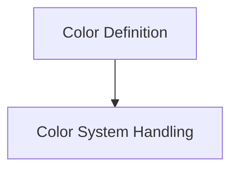

# rich_color Module Documentation

## Introduction

The `rich_color` module is a fundamental component of the Rich library, responsible for defining, representing, and managing colors. It provides the core abstractions for working with terminal colors, adapting to different color capabilities, and ensuring a consistent visual experience across various environments.

## Architecture Overview

The `rich_color` module is organized into two primary sub-modules:

-   `color_definition`: This sub-module focuses on the fundamental data structures for defining and representing colors.
-   `color_system_handling`: This sub-module deals with how Rich interacts with the terminal's color capabilities to render colors correctly.

Together, these sub-modules ensure that Rich can effectively utilize and display a wide range of colors, from basic ANSI colors to 24-bit true colors, depending on the terminal's support.

## Sub-modules

### Color Definition ([color_definition.md](color_definition.md))

This sub-module encapsulates the `Color` object, which is the primary representation of a color within Rich, and `ColorType`, an enumeration defining various color representations. It provides the building blocks for specifying colors that can then be applied to text and other renderables.

### Color System Handling ([color_system_handling.md](color_system_handling.md))

The `color_system_handling` sub-module, primarily through the `ColorSystem` class, is responsible for detecting the color capabilities of the current terminal and adapting Rich's color rendering accordingly. It ensures that the most appropriate color depth (e.g., 8-bit, 24-bit) is used for optimal display.

<!-- DIAGRAM_JSON
{
    "direction": "TD",
    "nodes": [
        {"id": "color_definition", "label": "Color Definition", "type": "module", "link": "color_definition.md"},
        {"id": "color_system_handling", "label": "Color System Handling", "type": "module", "link": "color_system_handling.md"}
    ],
    "edges": [
        {"source": "color_definition", "target": "color_system_handling"}
    ],
    "groups": []
}
-->

