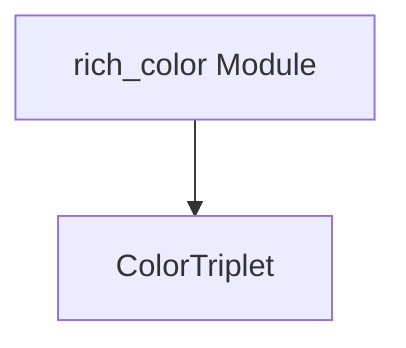

# rich_color_triplet Module Documentation

## Introduction

The `rich_color_triplet` module defines the `ColorTriplet` class, a fundamental data structure for representing colors in the Rich library. It provides a simple and efficient way to store RGB color values, which are then utilized by other Rich components for rendering colored text and elements.

## Core Functionality

The `rich_color_triplet` module exposes a single core component:

### `ColorTriplet`

The `ColorTriplet` class is a simple container for a color represented by three integer values: red, green, and blue (RGB). Each component typically ranges from 0 to 255. This class serves as a low-level representation of a color, which can be used by higher-level color handling mechanisms within Rich.

Its primary purpose is to provide an immutable and hashable representation of an RGB color, facilitating its use in various Rich components that require color information.

## Architecture and Component Relationships

The `ColorTriplet` component is a foundational building block for color representation within the Rich library. It is often used by the `rich_color` module's `Color` class, which provides more advanced color handling and conversion capabilities, including support for different color systems and terminal capabilities. `ColorTriplet` acts as the underlying data model for raw RGB values.

<!-- DIAGRAM_JSON
{
    "direction": "TD",
    "nodes": [
        {"id": "color_triplet", "label": "ColorTriplet", "type": "component", "link": null},
        {"id": "rich_color", "label": "rich_color Module", "type": "external", "link": "rich_color.md"}
    ],
    "edges": [
        {"source": "rich_color", "target": "color_triplet"}
    ],
    "groups": []
}
-->

## How the Module Fits into the Overall System

The `rich_color_triplet` module provides the most basic form of color representation for the Rich library. It is a dependency for modules like `rich_color`, which then abstract this representation into more functional and user-friendly `Color` objects. Essentially, `ColorTriplet` ensures that a consistent and simple RGB data structure is available for all Rich components that need to work with raw color values. It underpins the entire coloring system by providing the fundamental color data type.