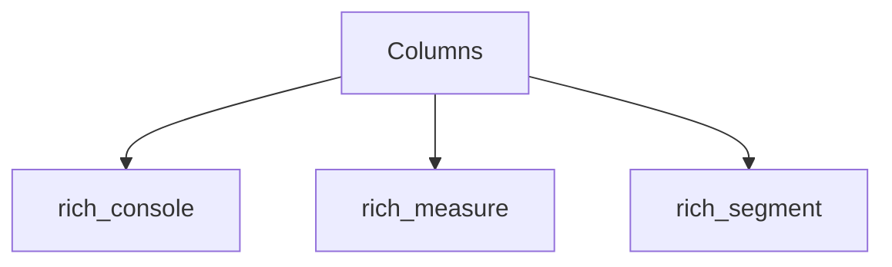

# rich_columns Module Documentation

## Introduction

The `rich_columns` module provides the `Columns` class, a powerful layout component in the Rich library designed to arrange multiple renderables into a column-based layout. It automatically calculates optimal column widths based on the available terminal width and the content of the renderables, ensuring an aesthetically pleasing and readable presentation.

## Architecture and Core Functionality

The `Columns` class acts as a container for other Rich renderable objects. When rendered, it takes a list of renderables and arranges them horizontally, wrapping content into multiple rows if necessary, similar to how text flows in a multi-column newspaper layout. This is particularly useful for displaying lists of items, short descriptions, or any content that benefits from a horizontal arrangement without explicitly managing individual column widths.

### Core Components

#### `Columns`

`Columns` is the primary class within this module. It inherits from `rich.console.ConsoleRenderable` (implicitly or explicitly, it's a renderable), allowing it to be directly printed to the console or used within other Rich layout components. Its main responsibility is to manage the layout of its child renderables.

Key features and behaviors of `Columns`:

*   **Automatic Layout Calculation**: `Columns` inspects the intrinsic width requirements of its contained renderables and the available console width to determine the best column arrangement.
*   **Horizontal Flow**: Renderables are laid out from left to right, and when the available width is exhausted, a new "row" of columns begins.
*   **Spacing**: It can automatically add spacing between columns to improve readability.
*   **Flexibility**: It accepts any object that can be rendered by Rich, including `Text`, `Panel`, `Table`, `Syntax`, and more.

### Relationships with Other Modules

The `rich_columns` module, specifically the `Columns` component, interacts closely with several other Rich modules to achieve its functionality:

*   **`rich_console`**: `Columns` utilizes the `Console` object from `rich_console` for rendering its content to the terminal. It relies on `ConsoleOptions` to determine the available width and other rendering constraints.
*   **`rich_measure`**: To perform its automatic layout calculations, `Columns` queries the `Measurement` of its contained renderables. `rich_measure` provides the utilities to determine the minimum, maximum, and natural width of renderables.
*   **`rich_segment`**: During the rendering process, `Columns` breaks down the content into `Segment` objects (from `rich_segment`) for efficient output to the terminal, respecting styles and colors.

## How `rich_columns` Fits into the Overall System

The `rich_columns` module provides a fundamental layout primitive that enhances the presentation capabilities of the Rich library. It's an essential tool for developers who need to organize and display information in a structured, multi-column format without manual layout management. It integrates seamlessly with other Rich renderables and layout components like `Panel` and `Layout` to build complex and visually appealing terminal user interfaces.

### Example Usage

```python
from rich.console import Console
from rich.columns import Columns
from rich.panel import Panel

console = Console()

renderables = [
    Panel("Item 1", width=20),
    Panel("Item 2 longer text", width=20),
    Panel("Item 3 shortest", width=20),
    Panel("Item 4 very very very long text that will wrap", width=20),
]

console.print(Columns(renderables))

# Or with a list of strings

console.print(Columns([f"Item {i}" for i in range(1, 11)]))
```

<!-- DIAGRAM_JSON
{
    "direction": "TD",
    "nodes": [
        {"id": "columns", "label": "Columns", "type": "component", "link": null},
        {"id": "rich_console", "label": "rich_console", "type": "external", "link": "rich_console.md"},
        {"id": "rich_measure", "label": "rich_measure", "type": "external", "link": "rich_measure.md"},
        {"id": "rich_segment", "label": "rich_segment", "type": "external", "link": "rich_segment.md"}
    ],
    "edges": [
        {"source": "columns", "target": "rich_console"},
        {"source": "columns", "target": "rich_measure"},
        {"source": "columns", "target": "rich_segment"}
    ],
    "groups": []
}
-->

