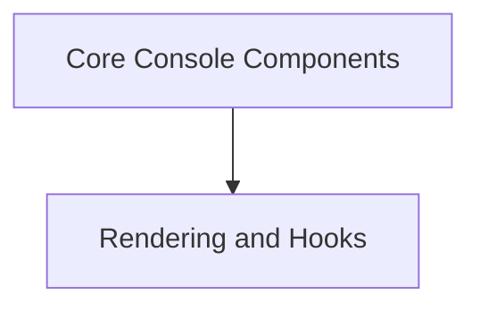

# `rich_console` Module Documentation

## Introduction
The `rich_console` module is the core of the Rich library, providing the central `Console` object and related components for rendering rich content to the terminal. It orchestrates how text, styles, and various renderable objects are displayed, handling terminal capabilities, dimensions, and output streams.

## Architecture Overview
The `rich_console` module is composed of several key sub-modules that work together to provide its extensive functionality. The `Core Console Components` sub-module defines the fundamental `Console` object and its configuration, while the `Rendering and Hooks` sub-module manages the rendering pipeline, screen updates, and custom rendering logic.

<!-- DIAGRAM_JSON
{
    "direction": "TD",
    "nodes": [
        {"id": "core_console_components", "label": "Core Console Components", "type": "module", "link": "core_console_components.md"},
        {"id": "rendering_and_hooks", "label": "Rendering and Hooks", "type": "module", "link": "rendering_and_hooks.md"}
    ],
    "edges": [
        {"source": "core_console_components", "target": "rendering_and_hooks"}
    ],
    "groups": []
}
-->

## Sub-modules

### [Core Console Components](core_console_components.md)
This sub-module encapsulates the central `Console` object, which is responsible for writing rich content to the terminal. It also includes key configuration objects like `ConsoleOptions` and `ConsoleDimensions`, and utilities for grouping renderables (`Group`) and managing captured output (`Capture`).

### [Rendering and Hooks](rendering_and_hooks.md)
This sub-module manages the intricate process of rendering content to the console. It includes `RenderHook` for custom rendering logic, `ScreenUpdate` for efficient screen redraws, and `ScreenContext`/`PagerContext` for managing the display environment. `ThemeContext` is also part of this module, influencing how styles are applied during rendering.