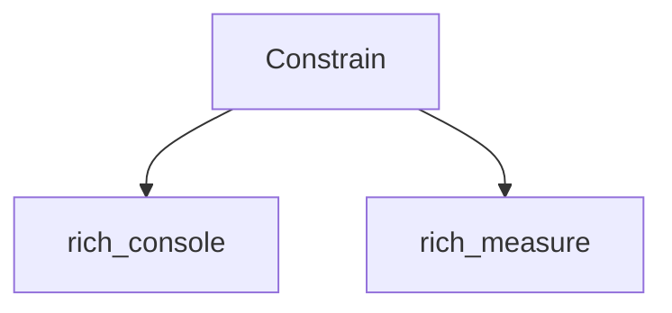

# `rich_constrain` Module Documentation

<!-- DIAGRAM_JSON
{
    "direction": "TD",
    "nodes": [
        {"id": "constrain", "label": "Constrain", "type": "component", "link": null},
        {"id": "rich_console", "label": "rich_console", "type": "external", "link": "rich_console.md"},
        {"id": "rich_measure", "label": "rich_measure", "type": "external", "link": "rich_measure.md"}
    ],
    "edges": [
        {"source": "constrain", "target": "rich_console"},
        {"source": "constrain", "target": "rich_measure"}
    ],
    "groups": []
}
-->

## Introduction

The `rich_constrain` module provides the `Constrain` class, a utility for limiting the maximum width of a renderable object in the `rich` library. This module is essential for controlling the layout and preventing content from exceeding desired boundaries, especially when rendering to terminals or other fixed-width displays.

## Core Functionality

The primary purpose of `rich_constrain` is to wrap any `rich` renderable and ensure its rendered output does not exceed a specified maximum width. This is achieved through its sole core component:

### `Constrain`

The `Constrain` class acts as a wrapper around another `ConsoleRenderable`. When `Constrain` is rendered, it delegates to the wrapped renderable but enforces a maximum width constraint during the rendering process. If the wrapped renderable's natural width exceeds the constraint, `Constrain` will intelligently truncate or adapt its rendering to fit within the allotted space.

**Key Features:**
*   **Width Limitation:** Guarantees that the wrapped content adheres to a maximum width.
*   **Flexible Wrapping:** Can wrap any object that implements the `rich.console.ConsoleRenderable` interface.
*   **Layout Control:** Provides a fundamental building block for more complex layout managers.

## Architecture and Component Relationships

The `rich_constrain` module is relatively simple, primarily relying on the `Constrain` component to interact with other core `rich` modules for its functionality.

*   **`Constrain`**: This component is the central piece of the module. It holds a reference to the renderable it needs to constrain.
*   **`rich_console`**: The `Constrain` class operates within the `rich` rendering pipeline, making extensive use of the `rich_console` module. Specifically, it works with `rich.console.Console` and expects its wrapped content to be a `rich.console.ConsoleRenderable`. During the rendering process, `Constrain` modifies the `ConsoleOptions` passed to the wrapped renderable to enforce the maximum width.
*   **`rich_measure`**: To determine how much space a renderable requires, `Constrain` interacts with the `rich_measure` module. It uses `rich.measure.Measurement` to understand the natural width of its contained renderable before applying its own width limits.

## How it Fits into the Overall System

The `rich_constrain` module serves as a critical utility for layout management within the `rich` ecosystem. Its `Constrain` component is often used implicitly or explicitly by higher-level layout constructs to manage the dimensions of their child elements.

*   **Layout Management**: Modules like `rich_panel.md`, `rich_columns.md`, and `rich_table.md` can utilize `Constrain` internally or expose mechanisms for users to apply width constraints to their content, ensuring that complex UIs render correctly across various terminal sizes.
*   **Preventing Overflow**: By setting explicit maximum widths, `rich_constrain` helps prevent text and other elements from overflowing their intended display areas, leading to more readable and aesthetically pleasing output.
*   **Composable Design**: `Constrain` adheres to the composable nature of `rich` renderables. It can wrap any renderable, and in turn, can be wrapped by other renderables, allowing for sophisticated and layered layout control.