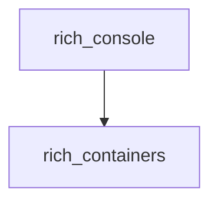

# rich_containers Module

## Introduction and Purpose

The `rich_containers` module provides fundamental data structures for holding and managing renderable content within the Rich library. It acts as a foundational layer for organizing visual elements before they are ultimately displayed on the console. This module is crucial for maintaining the structure and flow of rendered output.

## Architecture Overview

The `rich_containers` module primarily exposes two core components, `Renderables` and `Lines`, which serve as containers for various Rich renderable objects and styled text lines, respectively. These containers are often utilized by other Rich modules, such as `rich_console`, to process and display content effectively.

<!-- DIAGRAM_JSON
{
    "direction": "TD",
    "nodes": [
        {"id": "rich_containers", "label": "rich_containers", "type": "module"},
        {"id": "rich_console", "label": "rich_console", "type": "module", "link": "rich_console.md"}
    ],
    "edges": [
        {"source": "rich_console", "target": "rich_containers"}
    ],
    "groups": []
}
-->

## Core Components

### Renderables

The `Renderables` component serves as a generic container for any object that can be rendered by Rich. It allows for the aggregation of multiple renderable elements, providing a structured way to handle collections of content that need to be displayed sequentially or in a grouped manner. This is particularly useful when composing complex layouts or dynamic content.

### Lines

The `Lines` component is designed to hold a collection of `Text` objects or strings, representing individual lines of output. It is instrumental in managing and manipulating multi-line content, especially when styling or layout adjustments are required for each line. This component provides the necessary structure for Rich to efficiently process and render text-based output.
