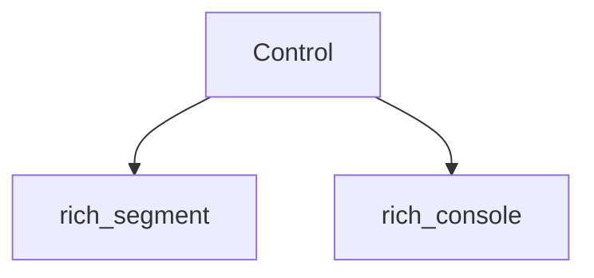

# rich_control Module Documentation

## Introduction

The `rich_control` module is a fundamental component of the Rich library, responsible for encapsulating and managing special control codes and sequences used during the rendering process. Its primary purpose is to provide a structured way to represent non-textual instructions that influence how Rich content is displayed, such as cursor movement, line clearing, or other terminal manipulation commands.

The core of this module is the `Control` class, which acts as a container for these control codes, ensuring they are correctly interpreted and applied by the Rich console.

## Core Functionality

### `Control`

The `Control` component represents a single control code or a sequence of control codes. It allows Rich to issue commands to the terminal that go beyond simple text rendering. Examples include: clear line, move cursor, show / hide cursor, etc.

It is an immutable object that can be combined with other `Segment` objects (from the `rich_segment` module) to form a complete rendered output. The `Control` object typically stores a `ControlType` enum (from `rich_segment`) and any associated arguments required by the control command.

Key features of `Control`:
-   **Encapsulation**: Stores control types and their arguments.
-   **Serialization**: Can be converted into terminal-specific escape sequences.
-   **Immutability**: Once created, a `Control` object cannot be modified.
-   **Composability**: Designed to be used alongside text segments for rich output.

## Architecture and Component Relationships

The `rich_control` module, through its `Control` component, plays a crucial role in enabling advanced terminal interactions within the Rich library. It primarily interacts with the `rich_segment` module to define the types of controls and the `rich_console` module for the actual application of these controls during rendering.

### Dependencies:

*   **`rich_segment`**: The `Control` component depends on the `rich_segment` module (specifically `ControlType`) to define the various types of control codes that can be represented. For more details, refer to the [rich_segment documentation](rich_segment.md).
*   **`rich_console`**: The `Control` objects are processed and applied by the `Console` class in the `rich_console` module during the rendering pipeline. The `Console` interprets these controls and translates them into appropriate terminal escape sequences. For more information, see the [rich_console documentation](rich_console.md).

## How the Module Fits into the Overall System

The `rich_control` module is a low-level utility that underpins Rich's ability to produce dynamic and interactive terminal output. It provides the mechanism for emitting non-printable characters and sequences that manipulate the terminal's state.

It is utilized by various higher-level Rich components, such as `rich_live` (for refreshing output), `rich_progress` (for animated progress bars), and `rich_screen` (for full-screen applications), all of which require precise control over the terminal cursor and content.

<!-- DIAGRAM_JSON
{
    "direction": "TD",
    "nodes": [
        {"id": "control_component", "label": "Control", "type": "component", "link": null},
        {"id": "rich_segment", "label": "rich_segment", "type": "external", "link": "rich_segment.md"},
        {"id": "rich_console", "label": "rich_console", "type": "external", "link": "rich_console.md"}
    ],
    "edges": [
        {"source": "control_component", "target": "rich_segment"},
        {"source": "control_component", "target": "rich_console"}
    ],
    "groups": []
}
-->

