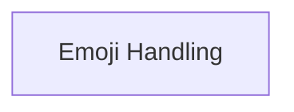

# rich_emoji Module Documentation

## Introduction

The `rich_emoji` module in the Rich library provides functionality for handling and rendering emojis within the console output. It allows for consistent display of emojis and offers mechanisms to manage their presence, especially in environments where emoji rendering might not be fully supported.

## Architecture

The `rich_emoji` module primarily focuses on the core logic for emoji representation and fallback. Its main component is dedicated to handling the display and non-display of emojis.

<!-- DIAGRAM_JSON
{
    "direction": "TD",
    "nodes": [
        {"id": "emoji_handling", "label": "Emoji Handling", "type": "module", "link": "emoji_handling.md"}
    ],
    "edges": [],
    "groups": []
}
-->

## Sub-modules

### Emoji Handling (`emoji_handling.md`)

This sub-module is responsible for managing how emojis are rendered. It includes the `Emoji` component for displaying emojis and the `NoEmoji` component as a placeholder or fallback when emojis cannot be displayed. It ensures that Rich can gracefully handle different console capabilities regarding emoji support.

