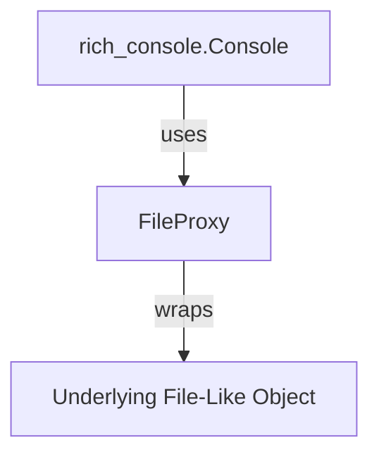

# `rich_file_proxy` Module Documentation

## Introduction

The `rich_file_proxy` module provides the `FileProxy` class, a utility for wrapping file-like objects. This allows Rich to intercept or modify operations on standard output streams (like `sys.stdout` or `sys.stderr`) or other custom file-like objects, facilitating advanced rendering capabilities such as capturing output, redirecting it, or applying rich styling.

## Architecture and Component Relationships

The `FileProxy` acts as an intermediary, forwarding calls to the underlying file-like object while potentially adding its own logic before or after the call. This is crucial for integrating Rich's advanced terminal rendering features with existing code that writes directly to standard output.

<!-- DIAGRAM_JSON
{
    "direction": "TD",
    "nodes": [
        {"id": "file_proxy", "label": "FileProxy", "type": "component", "link": null},
        {"id": "underlying_file", "label": "Underlying File-Like Object", "type": "external", "link": null},
        {"id": "rich_console", "label": "rich_console.Console", "type": "external", "link": "rich_console.md"}
    ],
    "edges": [
        {"source": "file_proxy", "target": "underlying_file", "label": "wraps"},
        {"source": "rich_console", "target": "file_proxy", "label": "uses"}
    ],
    "groups": []
}
-->

### `FileProxy`

`FileProxy` is the primary component of this module. It typically wraps a target file-like object (e.g., `sys.stdout`) and exposes methods like `write`, `flush`, `isatty`, etc., that delegate to the wrapped object. This allows Rich to replace standard output streams with a `FileProxy` instance, gaining control over how and when data is written to the terminal.

## How the Module Fits into the Overall System

The `rich_file_proxy` module is a low-level but essential part of the Rich library, particularly for its console rendering capabilities. It allows the main [rich_console](rich_console.md) module to effectively manage and control output to the terminal, enabling features such as:

*   **Live Displays:** By proxying `sys.stdout`, Rich can intercept output and refresh live displays (like progress bars or status messages) without interfering with direct print statements.
*   **Capture Output:** It can be used to capture all output written to a specific stream for later processing or display.
*   **Context Management:** `FileProxy` often plays a role in context managers that temporarily redirect `sys.stdout` or `sys.stderr` to a Rich-managed buffer or display.

This module ensures that Rich can seamlessly integrate with Python's standard I/O mechanisms while providing its rich formatting and interactive features.