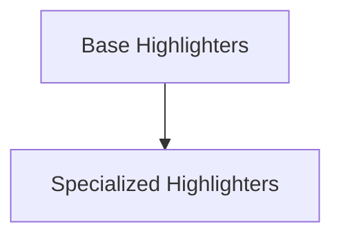

# rich_highlighter Module Documentation

## Introduction and Purpose

The `rich_highlighter` module in the `rich` library is responsible for providing a set of classes that enable syntax and content highlighting for various types of text. This module is crucial for enhancing the readability and visual appeal of console output by applying distinct styles to different parts of the text, such as code, data structures, and specific patterns.

## Architecture Overview

The `rich_highlighter` module's architecture is designed to be extensible, separating general-purpose highlighting from specialized highlighting for specific data formats or patterns. It consists of a base highlighting mechanism and several concrete implementations tailored for common use cases.

<!-- DIAGRAM_JSON
{
    "direction": "TD",
    "nodes": [
        {"id": "base_highlighters", "label": "Base Highlighters", "type": "module", "link": "base_highlighters.md"},
        {"id": "specialized_highlighters", "label": "Specialized Highlighters", "type": "module", "link": "specialized_highlighters.md"}
    ],
    "edges": [
        {"source": "base_highlighters", "target": "specialized_highlighters"}
    ],
    "groups": []
}
-->

## High-Level Functionality

### Base Highlighters

This sub-module provides the foundational highlighting capabilities within `rich_highlighter`. It includes the abstract `Highlighter` class, which serves as the base for all other highlighters, the `ReprHighlighter` for automatically highlighting Python object representations, and the `NullHighlighter` for cases where no highlighting is desired.

For more detailed information, refer to the [base_highlighters.md](base_highlighters.md) documentation.

### Specialized Highlighters

This sub-module focuses on highlighters designed for specific content types and patterns. It includes `ISO8601Highlighter` for recognizing and styling ISO 8601 date and time strings, `JSONHighlighter` for syntax highlighting JSON structures (often used in conjunction with the `rich_json` module), and `RegexHighlighter` for applying styles based on regular expressions.

For more detailed information, refer to the [specialized_highlighters.md](specialized_highlighters.md) documentation.
