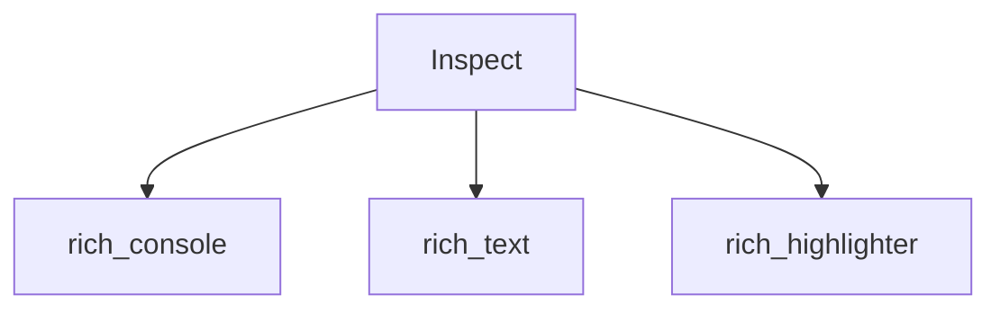

# rich_inspect Module

The `rich_inspect` module provides a powerful and visually appealing way to inspect Python objects at runtime. It enhances the standard introspection capabilities by integrating with Rich's rendering system, offering formatted and highlighted output that is easy to read and understand.

## Core Functionality

The primary component of this module is the `Inspect` class, which is responsible for analyzing an object and generating a rich representation of its attributes, methods, and structure.

### Inspect

`Inspect` is the central class in this module. It allows developers to get detailed, human-readable information about any Python object, including its type, value, attributes, methods, and their docstrings. This is particularly useful for debugging and understanding complex data structures or third-party libraries.

#### Features:

*   **Syntax Highlighting**: Code snippets and object representations are automatically highlighted for better readability.
*   **Collapsible Output**: For complex objects, the output can be condensed to show only essential information.
*   **Type Information**: Displays the type of each attribute and method.
*   **Docstring Display**: Shows docstrings for functions and methods.
*   **Rich Integration**: Leverages other Rich components for rendering, such as [rich_text](rich_text.md) and [rich_highlighter](rich_highlighter.md).

## Architecture

The `rich_inspect` module, with its `Inspect` component, relies on several other Rich modules to achieve its functionality. It primarily interacts with the [rich_console](rich_console.md) module for rendering output to the terminal, and utilizes [rich_text](rich_text.md) for constructing styled text. For syntax highlighting within the inspection output, it depends on the [rich_highlighter](rich_highlighter.md) module.

<!-- DIAGRAM_JSON
{
    "direction": "TD",
    "nodes": [
        {"id": "inspect", "label": "Inspect", "type": "component", "link": null},
        {"id": "console", "label": "rich_console", "type": "external", "link": "rich_console.md"},
        {"id": "text", "label": "rich_text", "type": "external", "link": "rich_text.md"},
        {"id": "highlighter", "label": "rich_highlighter", "type": "external", "link": "rich_highlighter.md"}
    ],
    "edges": [
        {"source": "inspect", "target": "console"},
        {"source": "inspect", "target": "text"},
        {"source": "inspect", "target": "highlighter"}
    ],
    "groups": []
}
-->
