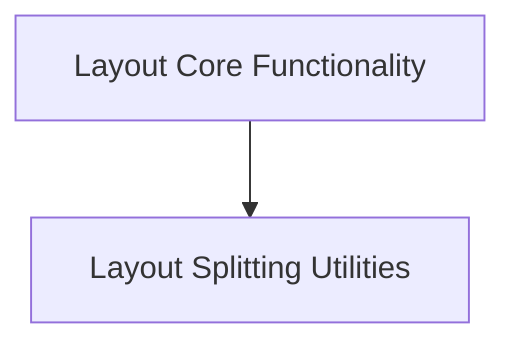

# rich_layout Module Documentation

## Introduction

The `rich_layout` module provides a powerful and flexible system for arranging and organizing rich renderables within a terminal application. It allows developers to create complex user interfaces by defining regions and relationships between different content blocks, enabling responsive and structured output.

## Architecture Overview

The `rich_layout` module is composed of core components for managing the layout structure and utilities for splitting and arranging layout regions. The architecture is designed to be modular, allowing for easy integration and extension of layout behaviors.

<!-- DIAGRAM_JSON
{
    "direction": "TD",
    "nodes": [
        {"id": "layout_core", "label": "Layout Core Functionality", "type": "module", "link": "layout_core.md"},
        {"id": "layout_splitting", "label": "Layout Splitting Utilities", "type": "module", "link": "layout_splitting.md"}
    ],
    "edges": [
        {"source": "layout_core", "target": "layout_splitting"}
    ],
    "groups": []
}
-->

## Sub-modules

### Layout Core Functionality ([layout_core.md](layout_core.md))
This sub-module manages the fundamental layout structure and rendering processes, including the main `Layout` object, its `LayoutRender` mechanism, and `_Placeholder` elements for dynamic content placement.

### Layout Splitting Utilities ([layout_splitting.md](layout_splitting.md))
This sub-module offers various utilities for dividing and organizing layout areas. It includes `Splitter`, `RowSplitter`, `ColumnSplitter`, and `NoSplitter` components, enabling flexible arrangement of content within the layout.
