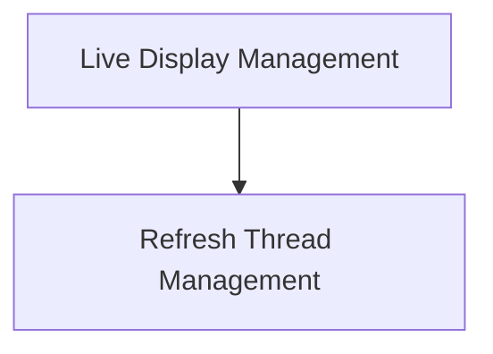

# rich_live Module Documentation

## Introduction

The `rich_live` module provides functionality for creating dynamic, live-updating displays in the terminal. It is essential for applications that need to show real-time progress, animations, or other frequently changing content without redrawing the entire screen. This module orchestrates the refreshing of such displays efficiently.

## Architecture Overview

The `rich_live` module is composed of two primary sub-modules:

1.  **Live Display Management (`live_display`)**: Manages the core logic for rendering and updating live content.
2.  **Refresh Thread Management (`refresh_thread`)**: Handles the background thread responsible for scheduling and executing refreshes.

These sub-modules work in tandem to ensure smooth and responsive live updates.

<!-- DIAGRAM_JSON
{
    "direction": "TD",
    "nodes": [
        {"id": "live_display", "label": "Live Display Management", "type": "module", "link": "live_display.md"},
        {"id": "refresh_thread", "label": "Refresh Thread Management", "type": "module", "link": "refresh_thread.md"}
    ],
    "edges": [
        {"source": "live_display", "target": "refresh_thread"}
    ],
    "groups": []
}
-->

## Sub-module Functionality

### Live Display Management

This sub-module, documented in [live_display.md](live_display.md), encapsulates the `Live` class. The `Live` class is the main interface for users to create and control live displays. It provides methods to start, stop, and update the displayed content, ensuring that changes are rendered efficiently to the terminal.

### Refresh Thread Management

The [refresh_thread.md](refresh_thread.md) documentation details the `_RefreshThread` component. This background thread is crucial for performance, as it handles the timing and execution of screen updates. It ensures that the display is refreshed at a controlled rate, preventing excessive redraws and flicker, thereby providing a smooth user experience.