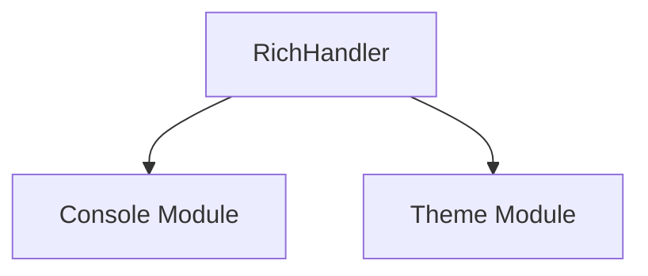

# `rich_logging` Module Documentation

## Introduction

The `rich_logging` module provides an enhanced logging handler, `RichHandler`, that integrates with the Rich library to output beautifully formatted and colorized log messages to the console. It aims to improve the readability and visual clarity of application logs, making debugging and monitoring more efficient.

## Core Functionality

The primary component of this module is `RichHandler`.

### `RichHandler`

The `RichHandler` class is a logging handler that formats log records using Rich's rendering capabilities. It can display various log attributes with colors, styles, and advanced layouts, such as tracebacks and pretty-printed data structures. This handler is designed to be a drop-in replacement for standard logging handlers, providing a superior visual experience.

**Key Features:**

*   **Colorized Output**: Automatically applies colors to log levels, timestamps, and other log components.
*   **Pretty Tracebacks**: Renders exceptions and tracebacks with syntax highlighting and context.
*   **Structured Data**: Can pretty-print complex data structures (e.g., dictionaries, lists) within log messages.
*   **Console Integration**: Leverages Rich's `Console` for flexible output to various terminals and environments.
*   **Theme Support**: Integrates with Rich themes for consistent styling across the application.

## Architecture and Component Relationships

The `rich_logging` module, through its `RichHandler`, primarily interacts with the `rich_console` module for rendering log messages to the terminal and the `rich_theme` module for applying custom styles.

<!-- DIAGRAM_JSON
{
    "direction": "TD",
    "nodes": [
        {"id": "rich_handler", "label": "RichHandler", "type": "component", "link": null},
        {"id": "rich_console", "label": "Console Module", "type": "external", "link": "rich_console.md"},
        {"id": "rich_theme", "label": "Theme Module", "type": "external", "link": "rich_theme.md"}
    ],
    "edges": [
        {"source": "rich_handler", "target": "rich_console"},
        {"source": "rich_handler", "target": "rich_theme"}
    ],
    "groups": []
}
-->

## How the Module Fits into the Overall System

The `rich_logging` module provides a crucial component for enhancing the observability of applications built with Rich. By replacing default logging handlers with `RichHandler`, developers can immediately benefit from clearer, more informative, and visually appealing log outputs. It acts as a bridge between the standard Python `logging` library and the advanced rendering capabilities of Rich, making it an essential utility for development, debugging, and production monitoring where enhanced log readability is desired.
