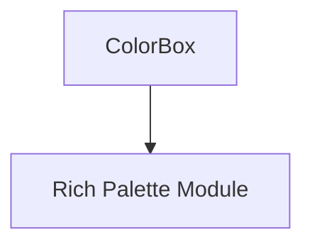

# rich_main Module Documentation

## Introduction

The `rich_main` module serves as a core component within the Rich library, providing a fundamental building block, `ColorBox`, which is crucial for handling color-related display elements. While seemingly simple, `ColorBox` plays an integral role in the visual rendering capabilities of Rich, often interacting with other color and style management modules.

## Core Functionality

The primary component of `rich_main` is `ColorBox`.

### `ColorBox`

The `ColorBox` component is responsible for representing and managing a single color display element. It acts as a container or descriptor for a specific color, enabling other Rich components to easily utilize and render colors consistently across the terminal output. It often works in conjunction with the `rich_palette` module to draw colors from a predefined palette or to define custom color representations.

## Architecture and Component Relationships

The `rich_main` module, through its `ColorBox` component, has a direct relationship with the `rich_palette` module, which defines and manages color palettes. `ColorBox` instances are likely to refer to or derive their properties from the colors defined in `rich_palette`.

<!-- DIAGRAM_JSON
{
    "direction": "TD",
    "nodes": [
        {"id": "color_box", "label": "ColorBox", "type": "component", "link": null},
        {"id": "rich_palette", "label": "Rich Palette Module", "type": "external", "link": "rich_palette.md"}
    ],
    "edges": [
        {"source": "color_box", "target": "rich_palette"}
    ],
    "groups": []
}
-->

## How the Module Fits into the Overall System

`rich_main` (via `ColorBox`) is a foundational module for color rendering in the Rich library. It provides the basic structure for color representation, which is then used by various other modules that need to display colored text or elements. For instance, modules like `rich_console`, `rich_style`, and `rich_text` would rely on the color definitions and handling capabilities provided by `ColorBox` to render rich, colored output. Its simplicity allows for a robust and consistent approach to color management throughout the entire Rich ecosystem, contributing to the rich visual experience users expect from the library.

