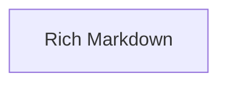

# Rich Markdown

Provides 20 component(s) for rich markdown operations.

## Components

This module contains 20 component(s):

- `ImageItem`
- `TableDataElement`
- `TextElement`
- `TableHeaderElement`
- `TableBodyElement`
- `MarkdownContext`
- `ListItem`
- `CodeBlock`
- `MarkdownElement`
- `UnknownElement`
- ... and 10 more

## Structure

---
*This documentation was auto-generated to ensure completeness.*
