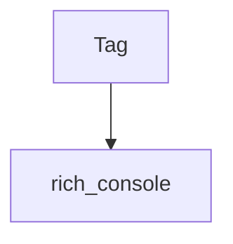

# rich_markup Module Documentation

## Introduction

The `rich_markup` module is a fundamental part of the Rich library, responsible for parsing and handling Rich's custom markup syntax. Its primary purpose is to enable the use of inline styling and formatting within strings, allowing for rich text output in terminals and other rendering contexts.

## Core Functionality

The `rich_markup` module introduces the concept of `Tag`, which represents a specific markup tag within a Rich string. These tags are used to apply styles, colors, and other formatting options to parts of the text. For example, `[bold]hello[/bold]` would use the `bold` tag to render "hello" in bold.

### `Tag` Component

The `Tag` component encapsulates the name of a markup tag and its associated arguments. It provides a structured way to represent and process the various formatting instructions embedded within Rich markup strings. This component is crucial for the `rich` library's ability to interpret and render rich text.

## Architecture and Component Relationships

The `rich_markup` module, with its central `Tag` component, serves as a parsing layer for Rich's text formatting. It processes markup strings into a series of `Tag` objects, which are then typically consumed by the `rich_console` module or other rendering components to apply the actual styling and display the text.

<!-- DIAGRAM_JSON
{
    "direction": "TD",
    "nodes": [
        {"id": "tag", "label": "Tag", "type": "component", "link": null},
        {"id": "rich_console", "label": "rich_console", "type": "external", "link": "rich_console.md"}
    ],
    "edges": [
        {"source": "tag", "target": "rich_console"}
    ],
    "groups": []
}
-->

