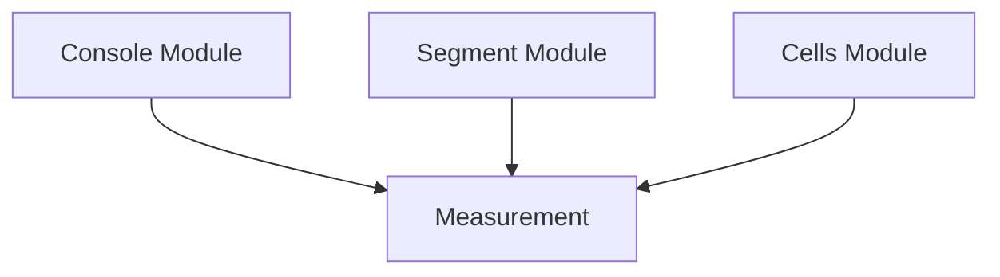

# `rich_measure` Module Documentation

## Introduction

The `rich_measure` module provides utilities for measuring the dimensions and extents of renderable content within the Rich library. Its primary component, `Measurement`, encapsulates the minimum and maximum width required for rendering an object.

## Core Functionality

### `Measurement`

The `Measurement` class is a fundamental data structure in Rich for representing the calculated width requirements of various renderables. It stores both a `minimum` and `maximum` width, providing a flexible way to handle content that can adapt to different display sizes.

Key aspects of `Measurement`:

*   **`minimum`**: The smallest possible width an object can occupy without truncation or undesirable wrapping.
*   **`maximum`**: The largest possible width an object can take, typically its natural width if given infinite space.

This class is crucial for layout managers and renderers to determine how content should be placed and wrapped on the console.

## Architecture and Component Relationships

The `rich_measure` module, specifically the `Measurement` component, plays a vital role in the rendering pipeline by providing essential dimension information. It interacts with several other Rich modules to facilitate accurate layout and display.

<!-- DIAGRAM_JSON
{
    "direction": "TD",
    "nodes": [
        {"id": "measurement", "label": "Measurement", "type": "component", "link": null},
        {"id": "rich_console", "label": "Console Module", "type": "external", "link": "rich_console.md"},
        {"id": "rich_segment", "label": "Segment Module", "type": "external", "link": "rich_segment.md"},
        {"id": "rich_cells", "label": "Cells Module", "type": "external", "link": "rich_cells.md"}
    ],
    "edges": [
        {"source": "rich_console", "target": "measurement"},
        {"source": "rich_segment", "target": "measurement"},
        {"source": "rich_cells", "target": "measurement"}
    ],
    "groups": []
}
-->

**Diagram Explanation:**

*   **`Measurement`**: The core component of this module, responsible for holding width measurements.
*   **`Console Module` (`rich_console`)**: Provides the overall console dimensions and rendering context, which `Measurement` uses to calculate its effective size.
*   **`Segment Module` (`rich_segment`)**: Deals with individual text segments and their widths, which are aggregated and managed by `Measurement`.
*   **`Cells Module` (`rich_cells`)**: Handles the low-level calculation of cell widths for characters, a dependency for `Measurement` to accurately determine content width.

## How the Module Fits into the Overall System

The `rich_measure` module is a foundational utility within the Rich library's layout and rendering system. It provides the crucial capability to determine and communicate the size requirements of renderable objects. Without accurate measurements, Rich would be unable to perform tasks such as:

*   **Text Wrapping**: Ensuring text fits within specified widths without overflowing.
*   **Layout Management**: Arranging multiple renderables efficiently within a given space (e.g., in `rich_columns`, `rich_table`, or `rich_layout`).
*   **Padding and Alignment**: Calculating the necessary padding or adjustments for proper alignment (`rich_padding`, `rich_align`).

Modules like `rich_console`, `rich_layout`, `rich_table`, and `rich_columns` heavily rely on the `Measurement` class to query the dimensions of the objects they are arranging, making `rich_measure` an indispensable part of Rich's robust display capabilities.
