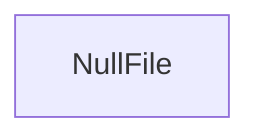

# rich_null_file Module Documentation

## Introduction
The `rich_null_file` module provides the `NullFile` class, a simple file-like object that discards all written data. It functions as a `/dev/null` equivalent within the `rich` library, useful for scenarios where output needs to be suppressed or when a file-like interface is required but no actual I/O operation should occur.

## Architecture and Component Relationships

The `rich_null_file` module is straightforward, containing a single core component, `NullFile`. This component implements the necessary methods of a file-like object (such as `write`, `read`, `flush`, `close`) but performs no operations, effectively acting as a data sink.

<!-- DIAGRAM_JSON
{
    "direction": "TD",
    "nodes": [
        {"id": "null_file", "label": "NullFile", "type": "component", "link": null}
    ],
    "edges": [],
    "groups": []
}
-->

## How the Module Fits into the Overall System
The `rich_null_file` module, through its `NullFile` component, serves a utility role within the `rich` ecosystem. It is primarily used when various `rich` components or external code require a file-like object for output but the intention is to suppress or ignore that output. For example, a `Console` instance (from the [rich_console.md](rich_console.md) module) could be configured to write to a `NullFile` when rich output is not desired, such as during automated testing or in environments where terminal output is not applicable. This prevents unnecessary resource consumption or side effects from writing to actual files or stdout/stderr.

Its simplicity ensures minimal overhead, and its adherence to the file-like object interface allows for seamless integration wherever such an object is expected, offering a flexible way to control output flow.
