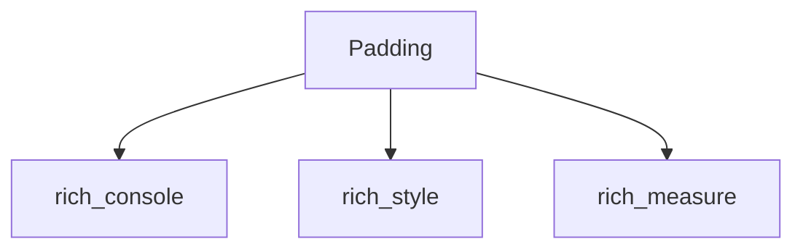

# `rich_padding` Module Documentation

## Introduction

The `rich_padding` module provides the `Padding` class, a versatile component for adding whitespace around renderable objects within the Rich library. This module is essential for controlling the visual spacing and layout of elements displayed in the terminal, enhancing readability and aesthetic appeal.

## Core Functionality

The primary purpose of `rich_padding` is to encapsulate a renderable object and apply specified padding around it. This allows developers to easily create visual separation between different components in their terminal applications.

### `Padding`

The `Padding` class is a renderable that takes another Rich renderable and padding dimensions as input. It then renders the inner renderable with the specified whitespace around it. Padding can be applied uniformly or independently to the top, right, bottom, and left sides.

## Architecture and Component Relationships

The `rich_padding` module is a leaf module, primarily centered around its `Padding` component. It interacts with several other Rich modules to perform its rendering and layout functions.

<!-- DIAGRAM_JSON
{
    "direction": "TD",
    "nodes": [
        {"id": "padding", "label": "Padding", "type": "component", "link": null},
        {"id": "rich_console", "label": "rich_console", "type": "external", "link": "rich_console.md"},
        {"id": "rich_style", "label": "rich_style", "type": "external", "link": "rich_style.md"},
        {"id": "rich_measure", "label": "rich_measure", "type": "external", "link": "rich_measure.md"}
    ],
    "edges": [
        {"source": "padding", "target": "rich_console"},
        {"source": "padding", "target": "rich_style"},
        {"source": "padding", "target": "rich_measure"}
    ],
    "groups": []
}
-->

## How it Fits into the Overall System

`rich_padding` integrates seamlessly into the Rich ecosystem by providing a fundamental layout primitive. Any Rich renderable object can be wrapped by `Padding` to control its spacing. It relies on `rich_console` for the actual rendering process, `rich_style` for potentially applying background styles to the padded area, and `rich_measure` to determine the appropriate dimensions for rendering and layout calculations. This makes `rich_padding` a crucial utility for composing complex and visually organized terminal outputs.