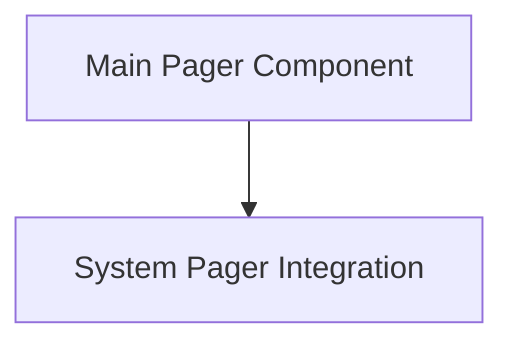

# Rich Pager Module

## Introduction and Purpose
The `rich_pager` module provides functionality for displaying rich content in a paginated manner within a terminal. It allows for handling output that exceeds the terminal's visible area, either by its own internal paging mechanism or by integrating with external system pagers.

## Architecture Overview

The `rich_pager` module is composed of two primary sub-modules:

- **Pager Component**: This component manages the internal paging logic for rich content.
- **System Pager Integration**: This component handles the interaction and delegation to external system pagers (like `less` or `more`).

These components work together to ensure that large outputs are presented in a user-friendly and navigable way, adapting to the environment's capabilities.

## High-Level Functionality

### [Main Pager Component](pager_component.md)
This sub-module encapsulates the `Pager` class, which is responsible for buffering and displaying rich content in pages. It provides the core mechanism for paginating output directly within the application when an external system pager is not available or desired.

### [System Pager Integration](system_pager_component.md)
This sub-module contains the `SystemPager` class, which acts as an interface to external terminal pagers. It detects the presence of system pagers and routes rich output through them, leveraging their advanced features like searching and scrolling.

<!-- DIAGRAM_JSON
{
    "direction": "TD",
    "nodes": [
        {"id": "pager_component", "label": "Main Pager Component", "type": "module", "link": "pager_component.md"},
        {"id": "system_pager_component", "label": "System Pager Integration", "type": "module", "link": "system_pager_component.md"}
    ],
    "edges": [
        {"source": "pager_component", "target": "system_pager_component"}
    ],
    "groups": []
}
-->
