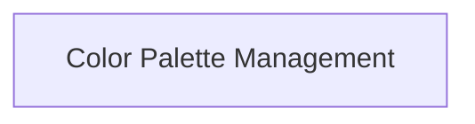

# rich_palette Module Documentation

## Introduction
The `rich_palette` module in Rich provides core functionalities for defining and managing color palettes, which are essential for consistent and appealing visual styling across various Rich components. It encapsulates the representation of colors and their organization into distinct palettes, allowing for a unified approach to color management throughout an application.

## Architecture Overview
The `rich_palette` module is structured to manage color definitions and their representation. It primarily consists of a single sub-module: `color_palette_management`, which handles the creation and manipulation of color palettes.

<!-- DIAGRAM_JSON
{
    "direction": "TD",
    "nodes": [
        {"id": "color_palette_management", "label": "Color Palette Management", "type": "module", "link": "color_palette_management.md"}
    ],
    "edges": [],
    "groups": []
}
-->

## Sub-modules

### Color Palette Management
The [Color Palette Management](color_palette_management.md) sub-module is responsible for defining and managing collections of colors (`Palette`) and individual color components (`ColorBox`) that constitute a rich visual theme. It provides the building blocks for creating aesthetically pleasing and consistent user interfaces.
