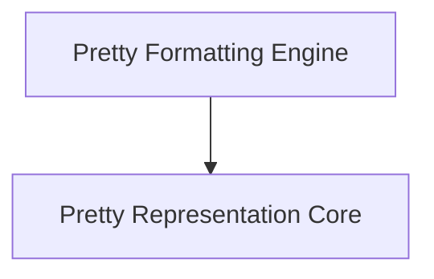

# rich_pretty Module Documentation

The `rich_pretty` module provides powerful and flexible utilities for "pretty printing" Python objects, making complex data structures more readable in the terminal. It is a core component of `rich`'s ability to present structured information in an appealing and understandable format.

## Architecture

The `rich_pretty` module is structured into two main sub-modules, focusing on the representation of objects for pretty printing and the actual formatting engine itself.

<!-- DIAGRAM_JSON
{
    "direction": "TD",
    "nodes": [
        {"id": "pretty_formatting", "label": "Pretty Formatting Engine", "type": "module", "link": "pretty_formatting.md"},
        {"id": "pretty_representation", "label": "Pretty Representation Core", "type": "module", "link": "pretty_representation.md"}
    ],
    "edges": [
        {"source": "pretty_formatting", "target": "pretty_representation"}
    ],
    "groups": []
}
-->

## Sub-modules

### [Pretty Formatting Engine](pretty_formatting.md)
This sub-module (`pretty_formatting`) contains the core logic for pretty printing and formatting, including the `Pretty` renderable and the `RichFormatter`. It's responsible for taking an object and turning it into a beautiful, formatted string for display.

### [Pretty Representation Core](pretty_representation.md)
The `pretty_representation` sub-module handles the internal representation of objects for pretty printing. This includes managing special cases like broken representations, and defining the `Node` and `_Line` structures that form the basis of the pretty-printed output tree.
