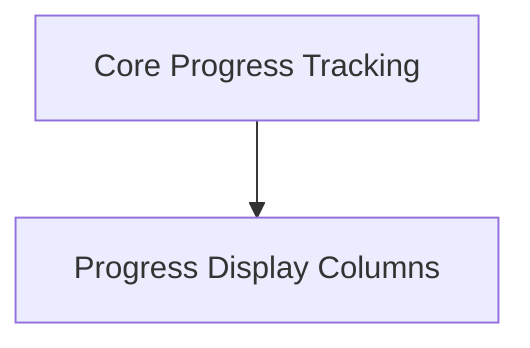

# Rich Progress Module

The `rich_progress` module in Rich provides a powerful and flexible way to display progress bars and indicators in the terminal. It allows developers to create highly customizable progress displays for long-running operations, file transfers, and other tasks.

## Architecture Overview

The `rich_progress` module is primarily composed of two main functional areas:

1.  **Core Progress Tracking (`progress_core.md`)**: This sub-module handles the fundamental logic for creating, managing, and updating tasks, as well as coordinating background operations like data reading.
2.  **Progress Display Columns (`progress_columns.md`)**: This sub-module defines a rich set of customizable column types that can be used to visualize various aspects of a task's progress, such as completion percentage, elapsed time, transfer speed, and custom text.

These components work together to provide a comprehensive and visually appealing progress reporting system.

<!-- DIAGRAM_JSON
{
    "direction": "TD",
    "nodes": [
        {"id": "progress_core", "label": "Core Progress Tracking", "type": "module", "link": "progress_core.md"},
        {"id": "progress_columns", "label": "Progress Display Columns", "type": "module", "link": "progress_columns.md"}
    ],
    "edges": [
        {"source": "progress_core", "target": "progress_columns"}
    ],
    "groups": []
}
-->

## Sub-modules

*   [Core Progress Tracking](progress_core.md)
*   [Progress Display Columns](progress_columns.md)
