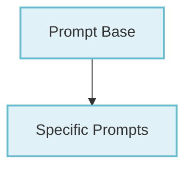

# Rich Prompt Module

## Introduction

The `rich_prompt` module provides a powerful and flexible system for creating interactive command-line prompts within the Rich library. It allows developers to easily solicit various types of input from users, from simple confirmations to specific data types like integers and floats, with a consistent and visually appealing interface.

## Purpose

The primary purpose of this module is to abstract the complexities of interactive input handling, offering a set of ready-to-use prompt classes that can be customized to fit different application requirements. It aims to enhance user experience in terminal applications by making data input intuitive and robust.

## Architecture Overview

The `rich_prompt` module is structured into core components that handle the fundamental logic of prompting and specialized components that extend this functionality for specific data types. The `PromptBase` and `Prompt` classes form the foundation, providing the common interface and methods for all prompts. Building upon this, specific prompt types like `Confirm`, `IntPrompt`, and `FloatPrompt` offer tailored implementations for boolean, integer, and floating-point inputs, respectively.

<!-- DIAGRAM_JSON
{
    "direction": "TD",
    "nodes": [
        {"id": "prompt_base", "label": "Base Prompt Functionality", "type": "module", "link": "prompt_base.md"},
        {"id": "specific_prompts", "label": "Specialized Prompt Types", "type": "module", "link": "specific_prompts.md"}
    ],
    "edges": [
        {"source": "prompt_base", "target": "specific_prompts"}
    ],
    "groups": []
}
-->

## Sub-modules

### [Base Prompt Functionality](prompt_base.md)

This sub-module contains the fundamental classes `PromptBase` and `Prompt`, which define the core behaviors and structures for all interactive prompts in the `rich_prompt` system. It handles the basic input loop, display, and validation mechanisms common to all prompt types.

### [Specialized Prompt Types](specific_prompts.md)

This sub-module extends the base prompt functionality to provide specific input types. It includes `Confirm` for boolean yes/no questions, `IntPrompt` for integer input, and `FloatPrompt` for floating-point number input. Each class handles type-specific validation and parsing, ensuring robust data collection.