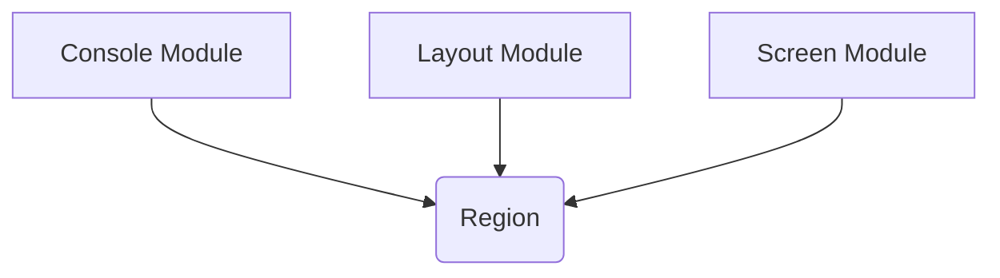

# rich_region Module Documentation

The `rich_region` module provides a fundamental data structure, `Region`, used to define rectangular areas within the Rich rendering system. This module is essential for managing and manipulating specific sections of the terminal or other display surfaces, allowing for precise control over where content is rendered.

<!-- DIAGRAM_JSON
{
    "direction": "TD",
    "nodes": [
        {"id": "region_component", "label": "Region", "type": "component", "link": null},
        {"id": "rich_console", "label": "Console Module", "type": "external", "link": "rich_console.md"},
        {"id": "rich_layout", "label": "Layout Module", "type": "external", "link": "rich_layout.md"},
        {"id": "rich_screen", "label": "Screen Module", "type": "external", "link": "rich_screen.md"}
    ],
    "edges": [
        {"source": "rich_console", "target": "region_component"},
        {"source": "rich_layout", "target": "region_component"},
        {"source": "rich_screen", "target": "region_component"}
    ],
    "groups": []
}
-->

### Purpose and Core Functionality

The primary purpose of the `rich_region` module is to encapsulate the concept of a rectangular area. The `Region` class typically defines coordinates (x, y) and dimensions (width, height), making it a cornerstone for any rendering operation that requires spatial awareness. This allows other Rich components to draw content within predefined bounds, manage screen real estate, and perform calculations related to object placement and collision detection.

### Architecture and Component Relationships

The `rich_region` module is a leaf module, containing only the `Region` class as its core component. It does not have any internal sub-modules. Instead, `Region` serves as a utility class that is consumed by various other modules within the Rich library.

**`Region` (Core Component)**:
The `Region` class is a simple yet powerful data structure representing a rectangular area. It typically holds attributes such as:
*   `x`: The x-coordinate of the top-left corner.
*   `y`: The y-coordinate of the top-left corner.
*   `width`: The width of the region.
*   `height`: The height of the region.

### How the Module Fits into the Overall System

The `rich_region` module plays a foundational role by providing the basic building block for spatial organization in Rich's rendering pipeline. It is crucial for:

*   **[rich_console](rich_console.md)**: The `Console` uses `Region` objects to determine where to render output, especially when dealing with specific sections of the terminal or when drawing complex layouts.
*   **[rich_layout](rich_layout.md)**: The `Layout` module heavily relies on `Region` to divide the display into various sections. Each `Layout` pane or area is essentially a `Region`, allowing for dynamic arrangement and resizing of content.
*   **[rich_screen](rich_screen.md)**: When managing full-screen applications or interactive interfaces, the `Screen` module uses `Region` to define viewports, scrollable areas, or interactive elements' boundaries.

By providing a standardized way to define and manipulate rectangular areas, `rich_region` ensures consistency and simplifies the development of complex rendering logic across the entire Rich library. It acts as an implicit dependency for many higher-level rendering constructs, enabling precise control over visual presentation.