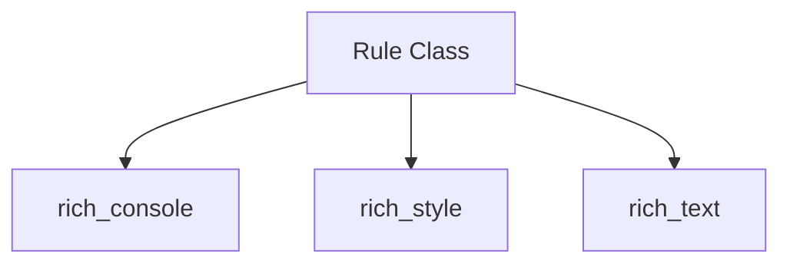

# rich_rule Module Documentation

## Introduction

The `rich_rule` module provides the `Rule` class, a versatile renderable that allows users to draw horizontal lines in the terminal. These rules can include a title, custom styling, and different line characters, making them useful for visually segmenting output, creating headers, or simply enhancing the aesthetic appeal of terminal applications.

## Module Architecture and Component Relationships

The `rich_rule` module is relatively simple, primarily encapsulating the `Rule` class. This class acts as a renderable component, taking care of the logic required to draw a formatted horizontal line across the console. It relies on other core `rich` modules for its functionality:

*   **`rich_console`**: The `Rule` class implements the `__rich_console__` method, making it compatible with Rich's console rendering system. It utilizes `rich_console.Console` for actual output.
*   **`rich_style`**: Styling for the rule (e.g., color, bold) is managed through the `rich_style.Style` object, allowing for rich customization of the line and its title.
*   **`rich_text`**: If a title is provided, it is rendered using `rich_text.Text` to ensure proper formatting and handling of markup within the title.

### Diagram

<!-- DIAGRAM_JSON
{
    "direction": "TD",
    "nodes": [
        {"id": "rule_class", "label": "Rule Class", "type": "component", "link": null},
        {"id": "rich_console", "label": "rich_console", "type": "external", "link": "rich_console.md"},
        {"id": "rich_style", "label": "rich_style", "type": "external", "link": "rich_style.md"},
        {"id": "rich_text", "label": "rich_text", "type": "external", "link": "rich_text.md"}
    ],
    "edges": [
        {"source": "rule_class", "target": "rich_console"},
        {"source": "rule_class", "target": "rich_style"},
        {"source": "rule_class", "target": "rich_text"}
    ],
    "groups": []
}
-->

## How it Fits into the Overall System

The `rich_rule` module serves as a basic but essential building block within the Rich library. It provides a simple yet powerful way to introduce visual structure and separation into terminal output. Developers use `Rule` instances to:

*   Create clear distinctions between different sections of log messages or application output.
*   Design headers and footers for custom layouts.
*   Improve the readability of complex information by breaking it down visually.

By being a standard `rich` renderable, `Rule` can be composed with other renderables like `Panel`, `Text`, `Columns`, and `Layout` to build sophisticated and visually appealing terminal user interfaces. Its integration with `rich_console` ensures it can be printed directly to the console or incorporated into any layout manager provided by the Rich library.