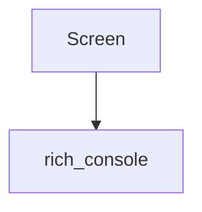

# `rich_screen` Module Documentation

## Introduction

The `rich_screen` module provides the `Screen` class, which represents a virtual screen for rendering Rich content. It is designed to manage the display area and facilitate rendering operations, potentially in scenarios where full-screen applications or custom display layouts are required.

## Architecture and Component Relationships

The `rich_screen` module is a leaf module containing a single core component, `Screen`. This component encapsulates the logic for handling a display screen within the Rich ecosystem. While it stands alone as a primary component, it implicitly interacts with other core Rich modules for rendering, styling, and console output.

<!-- DIAGRAM_JSON
{
    "direction": "TD",
    "nodes": [
        {"id": "screen", "label": "Screen", "type": "component", "link": null},
        {"id": "console", "label": "rich_console", "type": "external", "link": "rich_console.md"}
    ],
    "edges": [
        {"source": "screen", "target": "console"}
    ],
    "groups": []
}
-->

## Core Components

### `Screen`

The `Screen` class is the central component of this module. It provides an abstraction over a display area, allowing Rich renderables to be drawn onto it. It likely manages cursor position, clears the screen, and handles the output of rendered segments. Its primary role is to provide a context for rendering operations that require explicit control over the display.

## How the Module Fits into the Overall System

The `rich_screen` module, through its `Screen` component, offers a fundamental building block for advanced Rich applications that need to manage their display output explicitly. It is a specialized component that works in conjunction with the `rich_console` module, which is responsible for the actual rendering of content to the terminal. The `Screen` class would be used by developers who need fine-grained control over what is displayed on the terminal at any given moment, enabling scenarios like full-screen applications, interactive dashboards, or custom text-based user interfaces.

It can be seen as an orchestrator of visual output, utilizing the capabilities of the `rich_console` for the actual drawing mechanics.