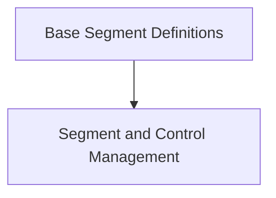

# Rich Segment Module

The `rich_segment` module provides the core primitives for representing and manipulating rich text segments within the Rich library. It defines the fundamental building blocks that enable advanced text formatting, styling, and console rendering.

## Architecture Overview

The `rich_segment` module is composed of several key components that work together to define and manage renderable segments. It is designed to be a low-level foundation for other Rich modules that build upon these segment definitions to create complex layouts and output.

<!-- DIAGRAM_JSON
{
    "direction": "TD",
    "nodes": [
        {"id": "segment_base", "label": "Base Segment Definitions", "type": "module", "link": "segment_base.md"},
        {"id": "segment_management", "label": "Segment and Control Management", "type": "module", "link": "segment_management.md"}
    ],
    "edges": [
        {"source": "segment_base", "target": "segment_management"}
    ],
    "groups": []
}
-->

## Sub-modules

### [Base Segment Definitions](segment_base.md)
This sub-module defines the `Segment` and `Segments` components, which are the fundamental units for representing pieces of formatted text or control sequences.

### [Segment and Control Management](segment_management.md)
This sub-module includes `SegmentLines` for organizing segments into lines and `ControlType` for defining various control characters or sequences that influence rendering behavior.
