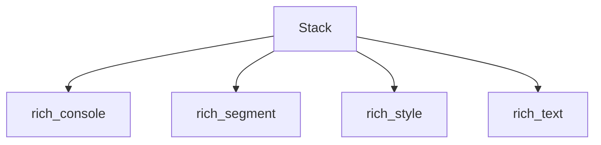

# rich_stack Module Documentation

## Introduction

The `rich_stack` module introduces the `Stack` component, a fundamental building block within the Rich library for organizing and displaying content in a vertical or horizontal arrangement. It provides a simple yet powerful way to compose multiple renderables, making it easier to manage layout and presentation.

## Module Architecture and Component Relationships

The `Stack` component serves as a container, accepting various Rich renderables and arranging them. Its primary interaction is with the `rich_console` module for rendering to the terminal. It might also leverage components from `rich_segment` for low-level segment manipulation, `rich_style` for applying styles, and `rich_text` for handling textual content.

<!-- DIAGRAM_JSON
{
    "direction": "TD",
    "nodes": [
        {"id": "stack", "label": "Stack", "type": "component", "link": null},
        {"id": "rich_console", "label": "rich_console", "type": "external", "link": "rich_console.md"},
        {"id": "rich_segment", "label": "rich_segment", "type": "external", "link": "rich_segment.md"},
        {"id": "rich_style", "label": "rich_style", "type": "external", "link": "rich_style.md"},
        {"id": "rich_text", "label": "rich_text", "type": "external", "link": "rich_text.md"}
    ],
    "edges": [
        {"source": "stack", "target": "rich_console"},
        {"source": "stack", "target": "rich_segment"},
        {"source": "stack", "target": "rich_style"},
        {"source": "stack", "target": "rich_text"}
    ],
    "groups": []
}
-->



## Core Components

### Stack

The `Stack` component is designed to hold and display a collection of Rich renderables. It provides a flexible way to group content that needs to be presented sequentially. While specific layout options (e.g., vertical or horizontal stacking) would typically be configured at instantiation, its core purpose is to act as a wrapper for multiple items that need to be rendered together.

#### Key Features:

*   **Container for Renderables**: Accepts any object that implements the `__rich_console__` protocol, allowing it to contain text, panels, tables, and other Rich components.
*   **Layout Management**: Simplifies the arrangement of multiple elements, making complex UIs easier to construct.
*   **Integration with Console**: Renders its contained elements via the Rich `Console`, inheriting its capabilities for styling, color, and output handling.

#### Usage Example (Conceptual):

```python
from rich.console import Console
from rich.text import Text
from rich.panel import Panel
# Assuming a Stack-like component exists
# from rich.stack import Stack

console = Console()

# Hypothetical usage of Stack
# stack_content = Stack(
#     Text("This is the first item"),
#     Panel("This is a panel in the stack"),
#     Text("And a final piece of text", style="bold green")
# )

# console.print(stack_content)
```

## How it Fits into the Overall System

The `rich_stack` module, through its `Stack` component, plays a role in the overall Rich ecosystem by providing a primitive for layout and composition. It allows developers to build more complex visual structures by grouping related renderables. This is crucial for creating well-organized and aesthetically pleasing terminal user interfaces, especially when combined with other layout components like `rich_columns` or `rich_layout` for more advanced arrangements. It underpins the ability to construct rich and dynamic terminal output efficiently.