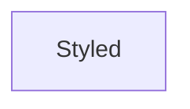

# `rich_styled` Module Documentation

## Introduction

The `rich_styled` module in the Rich library provides the `Styled` class, a fundamental building block for applying styles to renderable content. It encapsulates a renderable object and an associated style, enabling the consistent application of visual attributes across various Rich components.

## Architecture and Component Relationships

<!-- DIAGRAM_JSON
{
    "direction": "TD",
    "nodes": [
        {"id": "styled", "label": "Styled", "type": "component", "link": null}
    ],
    "edges": [],
    "groups": []
}
-->



## Core Components

### `Styled`

The `Styled` class is a simple yet powerful wrapper that allows any Rich renderable to be associated with a `Style` object. This is crucial for applying text formatting, colors, and other visual attributes in a declarative manner.

#### Purpose

The primary purpose of `Styled` is to facilitate the application of styles to arbitrary renderables. Instead of directly manipulating style attributes on every renderable, `Styled` provides a consistent interface to attach styling information. This promotes reusability and simplifies the styling logic throughout the Rich library.

#### Usage

`Styled` is typically used internally by other Rich components that need to apply a specific style to a part of their output. Developers can also use it directly to apply styles to custom renderables or when combining different Rich elements.

For example, to apply a "bold red" style to a `Text` object:

```python
from rich.text import Text
from rich.style import Style
from rich.styled import Styled

my_text = Text("Hello, World!")
my_style = Style(color="red", bold=True)
styled_text = Styled(my_text, my_style)

# styled_text can now be rendered by a Console to display "Hello, World!" in bold red.
```

#### Relationship to other modules

- **`rich_style`**: The `Styled` class heavily relies on the `Style` class from the [rich_style module](rich_style.md) to define the visual attributes to be applied. A `Styled` object always holds an instance of `Style`.
- **Renderables**: `Styled` can wrap any object that implements the Rich renderable protocol, making it a versatile tool for applying styles across the entire Rich ecosystem. This includes components from modules like `rich_text`, `rich_panel`, `rich_table`, and more.
- **`rich_console`**: When `Styled` objects are passed to a `Console` for rendering, the `Console` interprets the associated `Style` and applies the corresponding ANSI escape codes or other terminal commands to render the content with the specified visual attributes.

## How `rich_styled` Fits into the Overall System

The `rich_styled` module, through its `Styled` class, acts as a fundamental abstraction layer for styling in the Rich library. It ensures that styling is a distinct concern that can be applied uniformly across diverse renderable content. By decoupling the content from its presentation style, `Styled` contributes to the modularity and maintainability of the Rich codebase.

It serves as a bridge between the raw renderable data and the rich visual output, making it an indispensable component for any feature that involves custom or conditional styling. Its simplicity allows other more complex Rich components to easily incorporate styling without reimplementing styling logic.