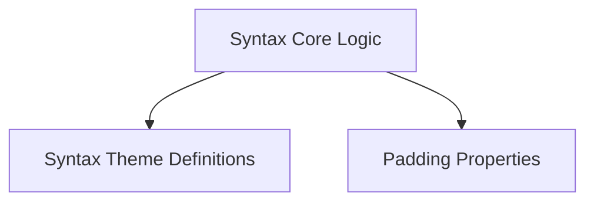

# rich_syntax Module Documentation

The `rich_syntax` module provides robust functionality for syntax highlighting, enabling the beautiful rendering of code and other structured text with customizable themes and formatting. It integrates with various highlighting engines and offers flexible display options.

## Architecture

The `rich_syntax` module is composed of several key sub-modules that work together to provide comprehensive syntax highlighting:

<!-- DIAGRAM_JSON
{
    "direction": "TD",
    "nodes": [
        {"id": "syntax_core", "label": "Syntax Core Logic", "type": "module", "link": "syntax_core.md"},
        {"id": "theme_definitions", "label": "Syntax Theme Definitions", "type": "module", "link": "theme_definitions.md"},
        {"id": "padding_utilities", "label": "Padding Properties", "type": "module", "link": "padding_utilities.md"}
    ],
    "edges": [
        {"source": "syntax_core", "target": "theme_definitions"},
        {"source": "syntax_core", "target": "padding_utilities"}
    ],
    "groups": []
}
-->

## Sub-modules

### [Syntax Core Logic](syntax_core.md)
This sub-module encapsulates the core logic for performing syntax highlighting. It includes the `Syntax` class which is responsible for taking source code and applying highlighting based on a chosen lexer and theme. It also manages highlighting ranges via `_SyntaxHighlightRange`.

### [Syntax Theme Definitions](theme_definitions.md)
The `theme_definitions` sub-module is concerned with defining and managing the visual themes used for syntax highlighting. It includes base classes like `SyntaxTheme` and concrete implementations such as `PygmentsSyntaxTheme` for integrating with Pygments styles and `ANSISyntaxTheme` for ANSI escape code-based themes.

### [Padding Properties](padding_utilities.md)
This sub-module handles the `PaddingProperty`, which defines how padding should be applied around highlighted syntax blocks. It contributes to the overall layout and presentation of the rendered code.
