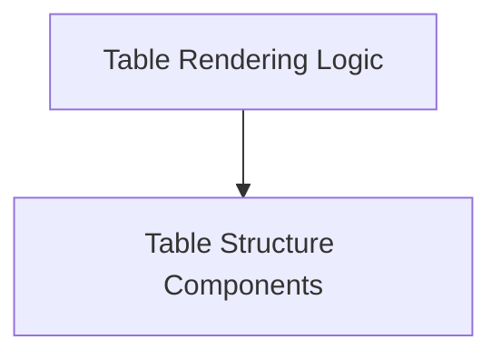

# Rich Table Module Documentation

The `rich_table` module in the Rich library provides robust functionalities for creating and rendering highly customizable tables in the terminal. It allows for structured data presentation with various styling options, column configurations, and cell manipulations.

## Architecture Overview

The `rich_table` module is composed of two primary sub-modules:

- **Table Structure (`table_structure.md`)**: Defines the fundamental building blocks of a table.
- **Table Rendering Logic (`table_renderer.md`)**: Handles the overall construction and display of tables.

<!-- DIAGRAM_JSON
{
    "direction": "TD",
    "nodes": [
        {"id": "table_structure", "label": "Table Structure Components", "type": "module", "link": "table_structure.md"},
        {"id": "table_renderer", "label": "Table Rendering Logic", "type": "module", "link": "table_renderer.md"}
    ],
    "edges": [
        {"source": "table_renderer", "target": "table_structure"}
    ],
    "groups": []
}
-->

## Sub-modules

### Table Structure

This sub-module (`table_structure.md`) is responsible for defining the individual components that make up a table. It includes:

- `Column`: Manages the properties and rendering of a table column.
- `Row`: Represents a single row of data within a table.
- `_Cell`: Handles the content and styling of an individual cell.

### Table Rendering Logic

The `table_renderer` sub-module (`table_renderer.md`) focuses on the overall process of taking the defined table structure and rendering it to the console. Its primary component is:

- `Table`: The main class for creating, configuring, and rendering a Rich table, orchestrating the use of `Column`, `Row`, and `_Cell` components.
