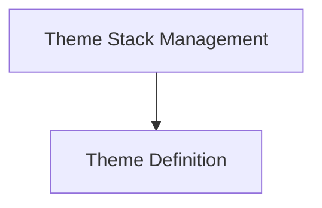

# Rich Theme Module Documentation

The `rich_theme` module is responsible for defining and managing themes within the Rich library. It allows for the customization of visual styles, including colors and text attributes, which are applied to rendered content.

## Architecture Overview

The `rich_theme` module consists of two primary components:

- **Theme Definition (`theme_definition.md`)**: Handles the creation and storage of individual theme configurations.
- **Theme Stack Management (`theme_stack_management.md`)**: Manages a stack of themes, enabling hierarchical theme application and dynamic switching.

These components work together to provide a flexible and robust theming system for Rich applications.

<!-- DIAGRAM_JSON
{
    "direction": "TD",
    "nodes": [
        {"id": "theme_definition", "label": "Theme Definition", "type": "module", "link": "theme_definition.md"},
        {"id": "theme_stack_management", "label": "Theme Stack Management", "type": "module", "link": "theme_stack_management.md"}
    ],
    "edges": [
        {"source": "theme_stack_management", "target": "theme_definition"}
    ],
    "groups": []
}
-->

## Sub-modules

### Theme Definition

This sub-module, documented in [`theme_definition.md`](theme_definition.md), focuses on defining the structure and properties of a Rich theme, including styles and colors. It encapsulates the `Theme` core component.

### Theme Stack Management

This sub-module, documented in [`theme_stack_management.md`](theme_stack_management.md), is responsible for managing a stack of active themes, allowing for dynamic theme application and inheritance. It encapsulates the `ThemeStack` core component.
