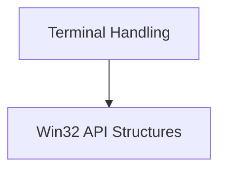

# rich_win32_console Module Documentation

## Introduction

The `rich_win32_console` module in the Rich library provides an interface for interacting with the Windows Console API. It defines structures and classes necessary for low-level console manipulation on Windows, enabling advanced text formatting and display capabilities specific to the Windows environment. This module is crucial for Rich's ability to render rich content effectively on Windows terminals, particularly older or legacy systems that may not fully support ANSI escape codes.

## Architecture Overview

The module is structured to encapsulate Windows-specific console data structures and provide a compatibility layer for rendering rich content. It primarily deals with retrieving and setting console information, managing cursor visibility, and interpreting screen buffer details.

<!-- DIAGRAM_JSON
{
    "direction": "TD",
    "nodes": [
        {"id": "win32_api_structures", "label": "Win32 API Structures", "type": "module", "link": "win32_api_structures.md"},
        {"id": "terminal_handling", "label": "Terminal Handling", "type": "module", "link": "terminal_handling.md"}
    ],
    "edges": [
        {"source": "terminal_handling", "target": "win32_api_structures"}
    ],
    "groups": []
}
-->

## Sub-modules

### [Win32 API Structures](win32_api_structures.md)
Defines data structures for interacting with the Windows Console API, such as cursor and screen buffer information.

### [Terminal Handling](terminal_handling.md)
Manages legacy Windows terminal interactions and coordinate systems for console output.
