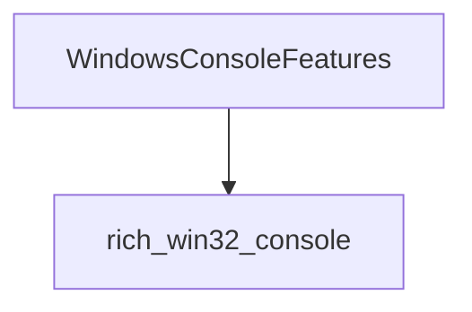

# `rich_windows` Module Documentation

## Introduction

The `rich_windows` module provides functionalities and features specifically tailored for rendering Rich content within a Windows console environment. It addresses the unique characteristics and limitations of Windows consoles, ensuring proper display and behavior of Rich's advanced rendering capabilities.

## Architecture and Component Relationships

The `rich_windows` module primarily exposes the `WindowsConsoleFeatures` component, which encapsulates logic for detecting and utilizing specific Windows console capabilities. This component likely interacts closely with the `rich_win32_console` module to leverage low-level Win32 API calls for console manipulation.

<!-- DIAGRAM_JSON
{
    "direction": "TD",
    "nodes": [
        {"id": "windows_console_features", "label": "WindowsConsoleFeatures", "type": "component", "link": null},
        {"id": "win32_console", "label": "rich_win32_console", "type": "external", "link": "rich_win32_console.md"}
    ],
    "edges": [
        {"source": "windows_console_features", "target": "win32_console"}
    ],
    "groups": []
}
-->

### `WindowsConsoleFeatures`

This class is responsible for abstracting the specific features available in the current Windows console. It might include methods for:

*   **Detecting console capabilities**: Such as true color support, virtual terminal sequence support, and buffer size.
*   **Enabling/Disabling features**: For example, activating virtual terminal processing for ANSI escape codes.
*   **Interfacing with Win32 APIs**: Likely through the `rich_win32_console` module to get and set console modes and information.

## How it Fits into the Overall System

The `rich_windows` module is a crucial part of Rich's cross-platform compatibility. When Rich is run on a Windows system, the `rich_windows` module, particularly `WindowsConsoleFeatures`, is queried to determine the best way to render output. It ensures that advanced features like colors, styles, and progress bars are displayed correctly, even if the underlying Windows console has different capabilities than a Unix-like terminal. It acts as an adapter layer, translating Rich's generic rendering instructions into Windows-specific console commands or by enabling modern console features when available.

It is indirectly used by the main `rich_console` module which orchestrates the rendering process, by providing it with information about the capabilities of the Windows console. 