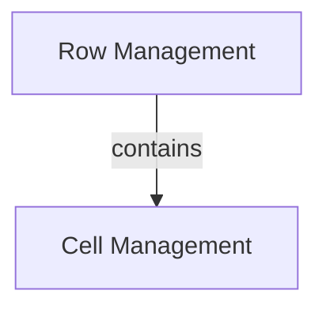

# Row and Cell Management Module

## Introduction

The `row_and_cell_management` module provides the core components for defining and managing rows and individual cells within tables in the Rich library. It is a fundamental part of the `rich_table` module's `table_structure` sub-module, ensuring the proper organization and rendering of tabular data.

## Architecture

This module is composed of two primary sub-modules:

*   **Cell Management**: Focuses on the properties and handling of individual table cells.
*   **Row Management**: Deals with the structure and containment of cells within a row.

The relationship between these components is straightforward: rows are containers for cells, forming the basic grid structure of a table.

<!-- DIAGRAM_JSON
{
    "direction": "TD",
    "nodes": [
        {"id": "row_management", "label": "Row Management", "type": "module", "link": "row_management.md"},
        {"id": "cell_management", "label": "Cell Management", "type": "module", "link": "cell_management.md"}
    ],
    "edges": [
        {"source": "row_management", "target": "cell_management", "label": "contains"}
    ],
    "groups": []
}
-->

## Sub-modules

### [Cell Management](cell_management.md)

This sub-module focuses on the `_Cell` component, which represents an individual data unit within a table. It defines how data is stored and managed at the most granular level within the table structure.

### [Row Management](row_management.md)

The `row_management` sub-module is built around the `Row` component. It dictates how multiple `_Cell` instances are organized horizontally to form a row, managing their layout and interaction within the table. This module is essential for constructing the linear segments of a table before they are arranged into a complete grid by the higher-level `rich_table` module.

