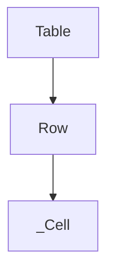

# `row_management` Module Documentation

The `row_management` module is a fundamental component within the `rich_table` package, specifically designed to encapsulate and manage the concept of a `Row` within a tabular data structure. It provides the building block for organizing cells horizontally in a Rich `Table` renderable.

## Purpose and Core Functionality

The primary purpose of the `row_management` module is to define and manage individual rows. The `Row` component, which is the core of this module, represents a single horizontal collection of cells in a `Table`. While the module itself doesn't directly render rows, it provides the data structure necessary for the `rich_table.table_renderer` module to interpret and display table content correctly.

Key responsibilities include:
-   Representing a collection of `_Cell` objects.
-   Maintaining the order of cells within the row.

## Architecture and Component Relationships

The `row_management` module is a leaf module, focusing solely on the `Row` component. It plays a crucial role in the overall `rich_table` architecture by defining how individual rows are structured.

<!-- DIAGRAM_JSON
{
    "direction": "TD",
    "nodes": [
        {"id": "Row", "label": "Row", "type": "component", "link": null},
        {"id": "_Cell", "label": "_Cell", "type": "external", "link": "cell_management.md"},
        {"id": "Table", "label": "Table", "type": "external", "link": "table_renderer.md"}
    ],
    "edges": [
        {"source": "Row", "target": "_Cell"},
        {"source": "Table", "target": "Row"}
    ],
    "groups": []
}
-->

### Component Breakdown:

*   **`Row`**: The central component of this module, representing a single row in a table. It aggregates `_Cell` objects.

### Dependencies:

*   **`_Cell`** (`cell_management.md`): `Row` objects are composed of `_Cell` objects, which define the individual data units within a row.
*   **`Table`** (`table_renderer.md`): The `Table` component from the `table_renderer` module utilizes `Row` objects to construct the overall table structure.

## How the Module Fits into the Overall System

The `row_management` module provides a fundamental data structure (`Row`) for the `rich_table` package. It works in conjunction with other modules like `cell_management` (for defining individual cells) and `table_renderer` (for orchestrating the rendering of the entire table).

In the larger Rich ecosystem, `Row` instances are created and managed by `Table` objects to build complex terminal outputs. Without the `Row` component, the `Table` renderable would lack the basic unit for organizing its content horizontally.
