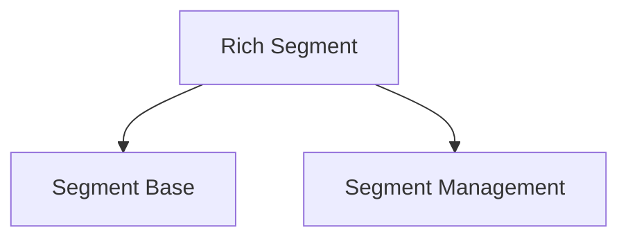

# Segment Base Module

The `segment_base` module is a fundamental component of the Rich library, responsible for defining the basic building blocks for rendering rich content in the terminal. It provides core classes for representing discrete segments of text or control sequences that collectively form a rendered output.

## Purpose

This module's primary purpose is to encapsulate the most atomic units of rendered content, allowing other Rich modules to compose these segments into complex layouts and styled outputs efficiently. It forms the backbone for how Rich manages and processes visual information.

## Core Functionality

*   **`Segment`**: Represents a single, contiguous piece of text or a control sequence with associated styling. Segments are the fundamental units that Rich renders to the terminal. Each segment can carry information about its text content, style, and whether it's a "line break" or an "end of line" marker.

*   **`Segments`**: A collection or sequence of `Segment` objects. This class provides an iterable interface over a list of segments, allowing for easy manipulation and processing of a series of rendered units. It acts as a container for managing the flow of segments.

## Architecture and Relationships

The `segment_base` module is a core part of the `rich_segment` family of modules. It works in conjunction with its sibling module, `segment_management`, which handles the organization and manipulation of `SegmentLines` and `ControlType`. Together, these modules provide a robust system for generating and managing complex terminal outputs.

<!-- DIAGRAM_JSON
{
    "direction": "TD",
    "nodes": [
        {"id": "rich_segment", "label": "Rich Segment (Parent)", "type": "external", "link": "rich_segment.md"},
        {"id": "segment_base", "label": "Segment Base", "type": "module", "link": "segment_base.md"},
        {"id": "segment_management", "label": "Segment Management", "type": "external", "link": "segment_management.md"}
    ],
    "edges": [
        {"source": "rich_segment", "target": "segment_base"},
        {"source": "rich_segment", "target": "segment_management"}
    ],
    "groups": []
}
-->

