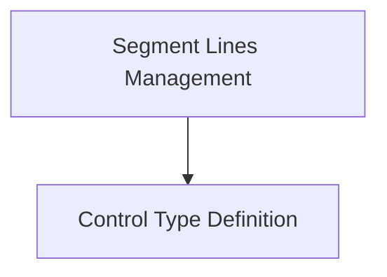

# `segment_components` Module Documentation

## Introduction
The `segment_components` module is a core part of the `rich_segment` module, specifically within the `segment_management` hierarchy. It focuses on defining fundamental structures for handling rendering control and organizing lines of display segments, crucial for Rich's advanced text formatting capabilities.

## Architecture Overview
The `segment_components` module is composed of two primary sub-modules: `segment_lines_management` and `control_type_definition`. These sub-modules work in tandem to manage how rich text segments are structured and how their rendering behavior is controlled, forming the foundational elements for displaying styled output.

<!-- DIAGRAM_JSON
{
    "direction": "TD",
    "nodes": [
        {"id": "segment_lines_management", "label": "Segment Lines Management", "type": "module", "link": "segment_lines_management.md"},
        {"id": "control_type_definition", "label": "Control Type Definition", "type": "module", "link": "control_type_definition.md"}
    ],
    "edges": [
        {"source": "segment_lines_management", "target": "control_type_definition"}
    ],
    "groups": []
}
-->

## Sub-modules

### [Segment Lines Management](segment_lines_management.md)
This sub-module, built around the `SegmentLines` component, is responsible for the organization and management of segmented lines. It provides the mechanism for Rich to handle and process lines that consist of multiple styled segments, enabling complex layout and rendering.

### [Control Type Definition](control_type_definition.md)
Centered on the `ControlType` component, this sub-module defines various control types that influence the rendering process of segments. These controls can dictate how segments are displayed, such as handling new lines or other special rendering instructions.
