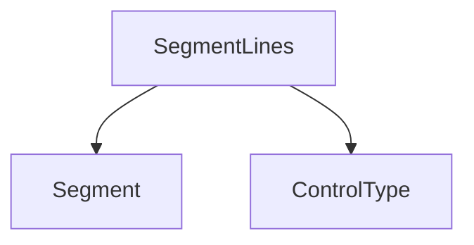

# `segment_lines_management`

## Introduction

The `segment_lines_management` module is a core component within the Rich library's rendering system. Its primary responsibility is to manage and represent lines of content as collections of `Segment` objects, facilitating advanced text and style handling in the terminal.

## Purpose and Core Functionality

This module defines the `SegmentLines` component, which is a specialized list of `Segment` objects. Each `Segment` represents a piece of text with associated style information. By encapsulating these segments into lines, the module enables Rich to precisely control the rendering of complex layouts, styling, and interactive elements.

The `SegmentLines` object essentially provides a structured way to handle visual lines, allowing for operations like joining, splitting, and styling without losing the rich metadata associated with each text segment.

## Architecture and Component Relationships

The `segment_lines_management` module is a leaf module focusing on the `SegmentLines` component. It forms a part of the broader `segment_components` and `rich_segment` hierarchy.

`SegmentLines` depends on the fundamental `Segment` objects for its composition and may implicitly interact with `ControlType` for advanced rendering commands.

<!-- DIAGRAM_JSON
{
    "direction": "TD",
    "nodes": [
        {"id": "segment_lines", "label": "SegmentLines", "type": "component", "link": null},
        {"id": "segment", "label": "Segment", "type": "external", "link": "segment_base.md"},
        {"id": "control_type", "label": "ControlType", "type": "external", "link": "control_type_definition.md"}
    ],
    "edges": [
        {"source": "segment_lines", "target": "segment"},
        {"source": "segment_lines", "target": "control_type"}
    ],
    "groups": []
}
-->

## How it Fits into the Overall System

The `SegmentLines` component is fundamental to how Rich renders content. When Rich needs to display any renderable (e.g., `Text`, `Panel`, `Table`), it converts the renderable into a series of `SegmentLines`. These lines are then processed by the console for final output to the terminal.

It acts as an intermediate representation between high-level renderables and low-level terminal output, ensuring that styling, colors, and control sequences are correctly applied and managed across lines of content. This module is thus crucial for the accurate and efficient display of all styled output within applications leveraging the Rich library.

For more details on the `Segment` object, refer to the [segment_base documentation](segment_base.md).
For more details on `ControlType`, refer to the [control_type_definition documentation](control_type_definition.md).
