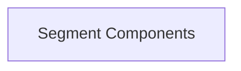

# Segment Management Module

The `segment_management` module is responsible for defining the core data structures and control types used to manage and render rich text segments within the system. It provides the foundational elements for handling lines of segments and control characters that influence rendering.

## Architecture Overview

The `segment_management` module is composed of a single sub-module that encapsulates its core functionalities. The diagram below illustrates its internal structure:

<!-- DIAGRAM_JSON
{
    "direction": "TD",
    "nodes": [
        {"id": "segment_components", "label": "Segment Components", "type": "module", "link": "segment_components.md"}
    ],
    "edges": [],
    "groups": []
}
-->

## Sub-modules

### [Segment Components](segment_components.md)
This sub-module ([`segment_components.md`](segment_components.md)) defines the fundamental building blocks for segment management, including `SegmentLines` for organizing segments into lines and `ControlType` for specifying special rendering instructions. It provides the essential types that other rendering modules interact with to process and display rich content.