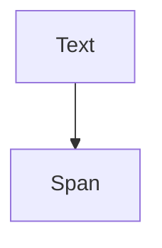

# Module: `span_object`

## Introduction

The `span_object` module is a fundamental component of the Rich library's text rendering capabilities, specifically focusing on the `Span` object. This module defines and manages `Span` objects, which are used to apply styles and formatting to specific segments of text within a `rich.text.Text` object. It provides the building blocks for detailed and granular text styling, allowing for rich and expressive console output.

## Architecture and Component Relationships

The `span_object` module is a leaf module that encapsulates the `Span` core component. Its primary role is to define the structure and behavior of text spans, which are crucial for styling and rendering text in the `rich_text` module. It directly supports the `Text` component found in the `text_object` module (which is a sibling module).

<!-- DIAGRAM_JSON
{
    "direction": "TD",
    "nodes": [
        {"id": "span", "label": "Span", "type": "component", "link": null},
        {"id": "text", "label": "Text", "type": "external", "link": "text_object.md"}
    ],
    "edges": [
        {"source": "text", "target": "span"}
    ],
    "groups": []
}
-->

## How the module fits into the overall system

The `span_object` module, through its `Span` component, is an integral part of the `rich_text` module's text rendering pipeline. The `Span` object allows for specifying a range of characters within a `Text` object and associating a `Style` (from `rich_style.Style`) with that range. This enables fine-grained control over text appearance, supporting features like syntax highlighting, colored output, and various text effects.

When a `Text` object is created or modified, `Span` objects are used internally to track the styling applied to different parts of the text. The `rich_console` module, when rendering a `Text` object, interprets these `Span` objects to produce the final styled output in the terminal. This modular design ensures that styling logic is clearly separated and efficiently managed.

## Core Components

### `Span`

The `Span` class represents a segment of text within a larger `Text` object to which a specific style is applied. It typically contains information about the start and end character indices of the segment, and the `Style` object to be applied.

*   **Purpose:** To define a contiguous range of characters within a `Text` instance that should be rendered with a particular style.
*   **Key Attributes (inferred):**
    *   `start` (int): The starting character index of the span.
    *   `end` (int): The ending character index of the span.
    *   `style` (str or [Style](rich_style.md)): The style to apply to the text segment. This often references styles defined in the `rich_style` module.
*   **Relationship:** `Span` objects are typically contained within `Text` objects (defined in `text_object.md`) to manage their styling.
