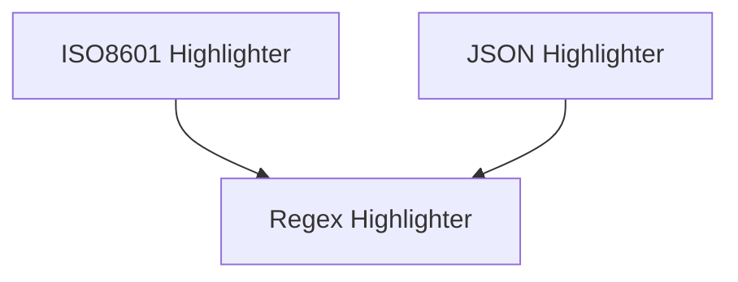

# Specialized Highlighters Module Documentation

The `specialized_highlighters` module provides advanced highlighting capabilities for specific data formats and patterns within the Rich library. It extends the core `rich_highlighter` functionality to offer specialized text formatting for ISO8601 date-times, JSON structures, and custom regular expression patterns.

## Architecture Overview

This module integrates with the broader `rich_highlighter` system, offering specific implementations for common highlighting needs. Its components are designed to be easily pluggable into Rich's rendering pipeline.

<!-- DIAGRAM_JSON
{
    "direction": "TD",
    "nodes": [
        {"id": "iso8601_highlighter_module", "label": "ISO8601 Highlighter", "type": "module", "link": "iso8601_highlighter_module.md"},
        {"id": "json_highlighter_module", "label": "JSON Highlighter", "type": "module", "link": "json_highlighter_module.md"},
        {"id": "regex_highlighter_module", "label": "Regex Highlighter", "type": "module", "link": "regex_highlighter_module.md"}
    ],
    "edges": [
        {"source": "iso8601_highlighter_module", "target": "regex_highlighter_module"},
        {"source": "json_highlighter_module", "target": "regex_highlighter_module"}
    ],
    "groups": []
}
-->

## Sub-modules

### ISO8601 Highlighter ([iso8601_highlighter_module.md](iso8601_highlighter_module.md))

This sub-module provides the `ISO8601Highlighter` component, which is responsible for automatically detecting and applying syntax highlighting to ISO8601 formatted date and time strings within rendered output. This enhances readability for logs and data displays that frequently feature timestamps.

### JSON Highlighter ([json_highlighter_module.md](json_highlighter_module.md))

The `json_highlighter_module` contains the `JSONHighlighter` component, designed to syntax highlight JSON text. It intelligently parses JSON structures, applying distinct styles to keys, values, strings, numbers, booleans, and nulls, making complex JSON data much easier to inspect.

### Regex Highlighter ([regex_highlighter_module.md](regex_highlighter_module.md))

This sub-module introduces the `RegexHighlighter` component, a versatile tool for applying highlighting based on user-defined regular expressions. It allows for highly customized text formatting, enabling developers to highlight specific patterns or keywords that are not covered by other specialized highlighters. This is particularly useful for custom log formats, code snippets, or any text requiring pattern-based emphasis.
