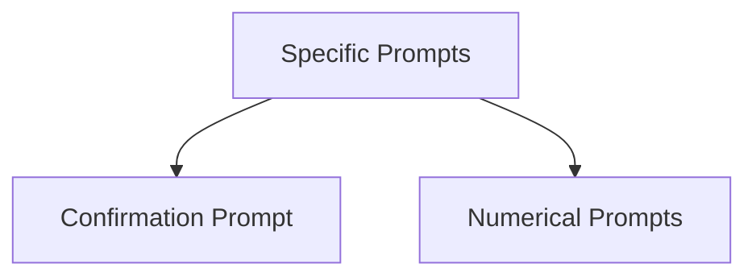

# specific_prompts Module Documentation

## Introduction

The `specific_prompts` module provides specialized prompt classes built upon the `PromptBase` for handling common user input scenarios. It includes dedicated prompts for boolean confirmations, integer inputs, and floating-point number inputs, simplifying the process of gathering specific types of data from users in a rich terminal environment.

## Architecture Overview

The `specific_prompts` module is structured into distinct sub-modules, each focusing on a particular type of prompt. This design ensures clear separation of concerns and facilitates easy extension for new prompt types. It builds upon the core `Prompt` and `PromptBase` components found in the `prompt_base` module to provide a consistent and robust prompting mechanism.

<!-- DIAGRAM_JSON
{
    "direction": "TD",
    "nodes": [
        {"id": "confirm_prompt", "label": "Confirmation Prompt", "type": "module", "link": "confirm_prompt.md"},
        {"id": "numerical_prompts", "label": "Numerical Prompts", "type": "module", "link": "numerical_prompts.md"}
    ],
    "edges": [
        {"source": "specific_prompts", "target": "confirm_prompt"},
        {"source": "specific_prompts", "target": "numerical_prompts"}
    ],
    "groups": []
}
-->

## Sub-modules

### [Confirmation Prompt](confirm_prompt.md)
This sub-module encapsulates the `Confirm` component, which is used to ask users for a yes/no response. It simplifies the handling of boolean inputs, providing a straightforward interface for common confirmation dialogs.

### [Numerical Prompts](numerical_prompts.md)
This sub-module groups the `IntPrompt` and `FloatPrompt` components. It provides robust mechanisms for prompting users to enter integer and floating-point numbers, including input validation and type conversion, ensuring that numerical data is collected accurately and reliably.
