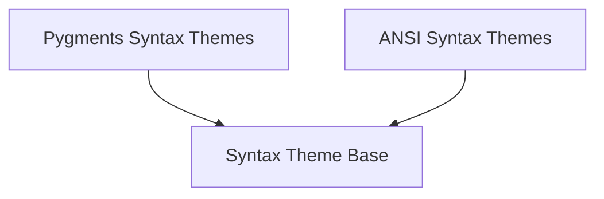

# Specific Syntax Themes Module

The `specific_syntax_themes` module is responsible for defining and managing different types of syntax themes used for highlighting code and text within the Rich library. It primarily deals with two main theme types: Pygments-based themes for robust code highlighting and ANSI-based themes for basic terminal color compatibility.

## Architecture Overview

The module's architecture is straightforward, separating the concerns of Pygments theme handling from ANSI theme management. Both types of themes are used by the broader [syntax_theme_base](syntax_theme_base.md) module.

<!-- DIAGRAM_JSON
{
    "direction": "TD",
    "nodes": [
        {"id": "pygments_themes", "label": "Pygments Syntax Themes", "type": "module", "link": "pygments_themes.md"},
        {"id": "ansi_themes", "label": "ANSI Syntax Themes", "type": "module", "link": "ansi_themes.md"},
        {"id": "syntax_theme_base", "label": "Syntax Theme Base", "type": "module", "link": "syntax_theme_base.md"}
    ],
    "edges": [
        {"source": "pygments_themes", "target": "syntax_theme_base"},
        {"source": "ansi_themes", "target": "syntax_theme_base"}
    ],
    "groups": []
}
-->

## Sub-modules

### [Pygments Syntax Themes](pygments_themes.md)
This sub-module ([`pygments_themes.md`](pygments_themes.md)) integrates and manages syntax themes derived from the Pygments library. It provides robust code highlighting capabilities by leveraging Pygments styles.

### [ANSI Syntax Themes](ansi_themes.md)
This sub-module ([`ansi_themes.md`](ansi_themes.md)) handles ANSI escape code-based syntax themes. It ensures compatibility with terminal color codes for basic and efficient text styling.

## Integration with Overall System

The `specific_syntax_themes` module serves as a crucial component for the Rich library's syntax highlighting functionality. It provides the concrete implementations of themes that are then utilized by the higher-level [syntax_core](syntax_core.md) module to render highlighted code. It depends on the abstract definitions found in [syntax_theme_base](syntax_theme_base.md) for its foundational structure.