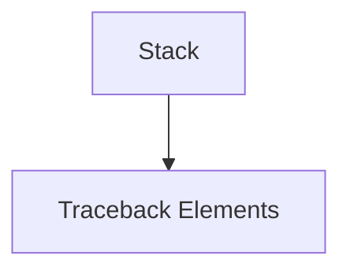

# stack_representation Module Documentation

## Introduction

The `stack_representation` module, a sub-module within `rich_traceback`, is dedicated to the robust representation and management of the call stack information within tracebacks. It provides the core `Stack` component, which is essential for rendering detailed and comprehensible stack traces.

## Module Architecture and Component Relationships

This module focuses on the `Stack` component, which encapsulates the logic and data structures required to present a formatted representation of a call stack. It integrates closely with other traceback-related modules, particularly `traceback_elements`, which provides the `Trace` and `Frame` components that constitute a complete traceback. The `Stack` component organizes and presents the frames within a trace.

## System Integration

The `stack_representation` module is a foundational piece of the `rich_traceback` system. It enables the visually appealing and informative display of exceptions and errors by handling the specific task of structuring and rendering the call stack. When a traceback is generated, `stack_representation`'s `Stack` component is utilized by higher-level modules to compile the individual frames and present them in a coherent manner to the user.

Refer to [rich_traceback.md](rich_traceback.md) for overall traceback functionality and [traceback_elements.md](traceback_elements.md) for details on `Trace` and `Frame` components.

<!-- DIAGRAM_JSON
{
    "direction": "TD",
    "nodes": [
        {"id": "stack_component", "label": "Stack", "type": "component", "link": null},
        {"id": "traceback_elements", "label": "Traceback Elements", "type": "external", "link": "traceback_elements.md"}
    ],
    "edges": [
        {"source": "stack_component", "target": "traceback_elements"}
    ],
    "groups": []
}
-->

