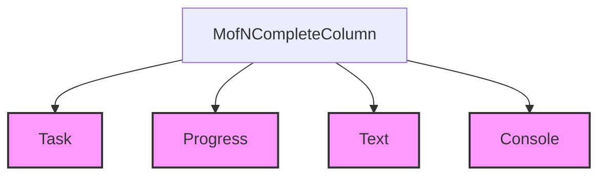

# status_columns Module Documentation

## Introduction
The `status_columns` module, a sub-module of `rich_progress.progress_columns`, provides specialized column types for displaying status information within Rich progress bars. Its primary component, `MofNCompleteColumn`, is designed to show the progress of a task in a "M of N completed" format. This module is crucial for offering clear, concise numerical feedback on task advancement in console applications.

## Architecture and Component Relationships

The `status_columns` module contains the `MofNCompleteColumn`, which is a concrete implementation of a `ProgressColumn` from the `rich_progress` module. It interacts closely with the `Task` object to retrieve current progress and total values. The rendering of its output relies on the `rich_text` module for string formatting and the `rich_console` module for display to the terminal.

<!-- DIAGRAM_JSON
{
    "direction": "TD",
    "nodes": [
        {"id": "mofn_complete_column", "label": "MofNCompleteColumn", "type": "component", "link": null},
        {"id": "task", "label": "Task", "type": "external", "link": "rich_progress.md"},
        {"id": "progress", "label": "Progress", "type": "external", "link": "rich_progress.md"},
        {"id": "text", "label": "Text", "type": "external", "link": "rich_text.md"},
        {"id": "console", "label": "Console", "type": "external", "link": "rich_console.md"}
    ],
    "edges": [
        {"source": "mofn_complete_column", "target": "task"},
        {"source": "mofn_complete_column", "target": "progress"},
        {"source": "mofn_complete_column", "target": "text"},
        {"source": "mofn_complete_column", "target": "console"}
    ],
    "groups": []
}
-->

## How it Fits into the Overall System
The `status_columns` module serves as a specialized display component within the larger [rich_progress](rich_progress.md) system. It enables developers to easily integrate a "M out of N" style progress indicator into their Rich progress bars, enhancing the user experience by providing clear, real-time status updates. By providing a flexible `ProgressColumn` implementation, it contributes to the modularity and extensibility of Rich's progress display capabilities, allowing for a wide variety of progress bar customizations.