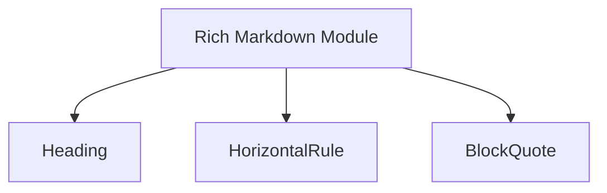

# `structural_markdown_blocks`

**Module Description:**

The `structural_markdown_blocks` module is a sub-component of the `rich_markdown` package, specifically designed to handle the rendering and representation of fundamental structural elements within Markdown documents. It encapsulates the logic for common Markdown constructs such as headings, horizontal rules, and block quotes, ensuring their correct interpretation and display.

This module plays a crucial role in constructing the overall layout and hierarchy of rendered Markdown content, providing the basic building blocks for more complex document structures.

## Architecture and Component Relationships

The `structural_markdown_blocks` module contains three primary components:

*   `Heading`: Represents a Markdown heading (e.g., `# Heading 1`, `## Heading 2`). It manages the level and text content of the heading.
*   `HorizontalRule`: Represents a thematic break in Markdown, typically rendered as a horizontal line (e.g., `---` or `***`).
*   `BlockQuote`: Represents a block quotation in Markdown (e.g., `> This is a quote.`). It handles the content within the quoted block.

These components are designed to be self-contained representations of their respective Markdown elements. They are utilized by the broader [rich_markdown](rich_markdown.md) module to parse and render Markdown text into a visually structured format. The `rich_markdown` module orchestrates how these structural blocks, along with other Markdown elements, are assembled to form the final output.

<!-- DIAGRAM_JSON
{
    "direction": "TD",
    "nodes": [
        {"id": "heading", "label": "Heading", "type": "component", "link": null},
        {"id": "horizontal_rule", "label": "HorizontalRule", "type": "component", "link": null},
        {"id": "block_quote", "label": "BlockQuote", "type": "component", "link": null},
        {"id": "rich_markdown", "label": "Rich Markdown Module", "type": "external", "link": "rich_markdown.md"}
    ],
    "edges": [
        {"source": "rich_markdown", "target": "heading"},
        {"source": "rich_markdown", "target": "horizontal_rule"},
        {"source": "rich_markdown", "target": "block_quote"}
    ],
    "groups": []
}
-->

## How it Fits into the Overall System

The `structural_markdown_blocks` module provides the foundational structural elements that are essential for rendering well-formatted Markdown documents within the `rich` ecosystem. It serves as a specialized library for managing and presenting the layout-defining aspects of Markdown content.

When the [rich_markdown](rich_markdown.md) module processes a Markdown string, it identifies these structural components and utilizes the corresponding classes from `structural_markdown_blocks` to create an internal representation. This separation of concerns allows for modular development and easier maintenance of the Markdown rendering pipeline, ensuring that structural elements are consistently handled and displayed according to their Markdown specifications.