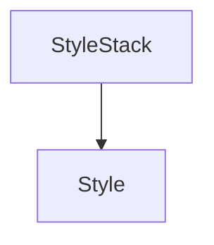

# `style_definition` Module Documentation

## Introduction

The `style_definition` module is a core component within the Rich library's styling system, specifically dedicated to defining individual styles. It provides the fundamental `Style` object, which encapsulates various visual attributes like color, background, bold, italic, and more, allowing for granular control over text rendering.

## Purpose and Core Functionality

The primary purpose of the `style_definition` module is to offer a robust and flexible way to create and manage distinct visual styles. Its core component, `Style`, is an immutable object that represents a collection of formatting attributes. These styles can then be applied to text segments, providing rich and customizable console output.

### Core Component: `Style`

The `Style` component is the cornerstone of this module. It allows developers to define a single visual style by combining multiple attributes such as:

*   **Color (foreground)**: Defines the text color.
*   **Background Color**: Defines the background color behind the text.
*   **Bold**: Renders text in bold.
*   **Italic**: Renders text in italic.
*   **Underline**: Underlines the text.
*   **Strike**: Strikes through the text.
*   **Reverse**: Swaps foreground and background colors.
*   **Dim**: Renders text with reduced intensity.
*   **Link**: Adds a clickable link to the text.

`Style` objects are designed to be immutable for consistency and thread-safety. They can be combined to create new styles, with later styles overriding conflicting attributes of earlier ones.

## Architecture and Component Relationships

The `style_definition` module, with its central `Style` component, forms the foundation for Rich's styling capabilities. It is a leaf module within the `rich_style` hierarchy, directly providing the building blocks for style management.

`Style` objects are primarily used by the [style_stack_management](style_stack_management.md) module, specifically by the `StyleStack` component. The `StyleStack` manages a stack of active styles, applying and removing them as text is rendered. When a `Style` object is pushed onto the `StyleStack`, its attributes are combined with the current active style to determine the final rendering properties.

<!-- DIAGRAM_JSON
{
    "direction": "TD",
    "nodes": [
        {"id": "style_definition_style", "label": "Style", "type": "component", "link": null},
        {"id": "style_stack_management_stylestack", "label": "StyleStack", "type": "external", "link": "style_stack_management.md"}
    ],
    "edges": [
        {"source": "style_stack_management_stylestack", "target": "style_definition_style"}
    ],
    "groups": []
}
-->

## How the Module Fits into the Overall System

The `style_definition` module is a fundamental part of Rich's rendering pipeline. It provides the essential `Style` objects that define how text and other renderables appear in the terminal. These `Style` objects are consumed by various other Rich components, including:

*   **`rich_console`**: The `Console` object uses `Style` to render styled text to the terminal.
*   **`rich_text`**: The `Text` object internally uses `Style` objects to manage and apply styles to different segments of text.
*   **Highlighters (e.g., `rich_highlighter`)**: Highlighters generate `Style` objects to colorize and format code or other patterns.

By centralizing style definition, `style_definition` ensures consistency and simplifies the management of visual attributes throughout the Rich ecosystem, enabling rich and expressive terminal output.
